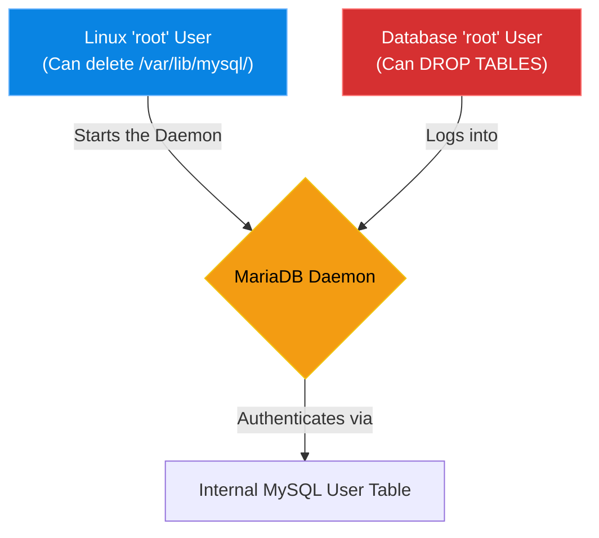

# Chapter 7 — Deploying MariaDB / MySQL

## Learning Objectives

By the end of this chapter, you will be able to:
* Understand the historical relationship between MySQL and MariaDB.
* Explain the difference between the Linux `root` user and the Database `root` user.
* Install MariaDB and start the service.
* Secure a fresh database installation using the `mysql_secure_installation` script.

## Visual Architecture: The Two Roots

One of the most confusing concepts for junior administrators is the concept of Database Users. The database has its own internal authentication system that is completely separate from `/etc/passwd`. 
Being the `root` Linux user does NOT automatically mean you are the `root` Database user (unless you explicitly configure it that way using a Unix Socket).

## Theory & Concepts

### 1. MySQL vs. MariaDB
MySQL is the most popular open-source relational database in the world. However, when it was purchased by Oracle Corporation, many developers feared it would become closed-source. 
The original creator of MySQL copied the source code and created a "fork" called **MariaDB**. 
Today, most Linux distributions ship MariaDB by default instead of MySQL. Because it is a direct fork, the commands are identical (e.g., you still type `mysql` to access the MariaDB shell).

### 2. The Default Installation Security Risk
When you install MariaDB (`sudo apt install mariadb-server`), it is notoriously insecure by default. 
* It comes with anonymous users.
* It allows anyone to connect to the test database.
* The database `root` user often has no password.

### 3. `mysql_secure_installation`
To fix the massive security holes of a fresh install, the developers included a built-in bash script. You must run this script immediately after installing the database. It will prompt you to set a strong root password, remove anonymous users, and disable remote root logins.

## Scenario-Based Troubleshooting

### Scenario A: The Open Door
**The Incident:** A junior developer deploys a new database server for a staging environment. They install MariaDB, open Port 3306 on the firewall, and go to lunch. An automated security scanner flags the server as critically compromised.

**The Investigation & Fix:**

1. The Support Engineer investigates the alert. They connect to the server's IP address from their own workstation using the MySQL client:
   `mysql -u root -h 10.0.0.55`
2. The database lets them in immediately, without asking for a password! The engineer now has full `root` access to the staging database.
3. The engineer logs into the actual Linux server. They realize the junior developer skipped the post-installation hardening step.
4. The engineer runs `sudo mysql_secure_installation`.
5. They answer the prompts:
   * Set root password? `Y`
   * Remove anonymous users? `Y`
   * Disallow root login remotely? `Y`
6. The engineer tries to connect from their workstation again. This time, the connection is instantly rejected. The database is secure.

> [!TIP]
> **Senior Engineer Note**
> When troubleshooting Deploying MariaDB / MySQL in production, never restart the service immediately. Restarts clear memory buffers, wipe temporary state, and destroy the exact evidence you need to find the root cause. Always capture logs (e.g., `journalctl` or container logs) *before* attempting a fix.

## Industry Incident Spotlight: The 2017 British Airways IT Outage

> [!CAUTION] **When High Availability Fails**
> In May 2017, British Airways suffered a massive IT outage that grounded flights globally for three days.
>
> **The Timeline:**
> - A contractor performing maintenance at a primary data center accidentally disconnected a power supply.
> - When power was restored minutes later, the surge caused massive damage to the database servers.
> - The automated failover to the backup data center failed because the database replication became unsynchronized and corrupted.
>
> **The Root Cause:**
> The primary database systems were violently shut down, and the disaster recovery protocols had not been properly tested for this specific "unclean shutdown" scenario.
>
> **The Business Impact:**
> 75,000 passengers stranded, thousands of flights canceled, and an estimated £80 million in compensation costs.
>
> **The Lessons Learned:**
> 1. **Test your Disaster Recovery.** Having a backup database is useless if the failover mechanism fails when you actually need it.
> 2. Uncontrolled power restoration can be more damaging than the power loss itself.

## Hands-on Lab

> [!TIP]
> **Practice Assignment Available**
> Proceed to the [Chapter 7 Practice Guide](../practice-files/V3-C07-practice.md) to install MariaDB, secure it, and log into the SQL prompt!

## Interview Questions

### Question 1: What is the relationship between MySQL and MariaDB?
* **Target Answer**: "MariaDB is a community-driven, open-source fork of MySQL. It was created by the original developers of MySQL after Oracle acquired the project. For almost all intents and purposes, it is a drop-in replacement, which is why you still use the `mysql` command-line client to interact with a MariaDB server."

### Question 2: Explain the difference between the Linux `root` user and the Database `root` user.
* **Target Answer**: "The Linux `root` user has supreme authority over the operating system files and processes (like starting or stopping the database service). The Database `root` user is an internal account created within the database software itself. It has supreme authority over the SQL tables and data, but it has no power over the underlying Linux OS. They are two completely separate authentication realms."

### Question 3: Why is running `mysql_secure_installation` considered a mandatory step after installing MariaDB?
* **Target Answer**: "By default, a fresh MariaDB installation contains several insecure defaults meant for testing purposes. It often includes a blank root password, anonymous user accounts, and a globally accessible 'test' database. The `mysql_secure_installation` script is an automated wizard that permanently removes these security risks and forces you to set a strong root password."

## Common Mistakes & Pro-Tips

> [!WARNING] Common Mistake
> Running MariaDB without running `mysql_secure_installation`, leaving the root password blank.

> [!CAUTION] Think Before You Type
> `DROP TABLE users;` (Do you have a backup from 5 minutes ago?)

## Chapter Summary

Installing the database is the easy part. Securing it is what makes you an engineer. Never assume software is secure by default, and always remember that database users exist in a completely different universe than Linux system users!

## Completion Checklist

- [ ] I understand the difference between the OS root user and the DB root user.
- [ ] I know why MariaDB is used as a replacement for MySQL.
- [ ] I know to always run `mysql_secure_installation` on a fresh server.

---

**Chapter Transition**
> MariaDB is excellent for traditional apps, but complex analytical queries might require something more robust.

---

## Navigation

← Previous: [Chapter 6 — Relational Database Concepts](V3-C06-database-concepts.md)

↑ Volume Contents: [Table of Contents](TOC.md)

→ Next: [Chapter 8 — Deploying PostgreSQL](V3-C08-deploying-postgresql.md)
