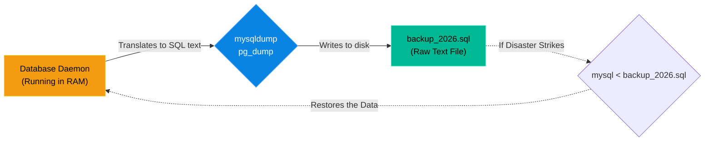

# Chapter 10 — Database Backup & Restoration

## Learning Objectives

By the end of this chapter, you will be able to:
* Explain the difference between Physical and Logical database backups.
* Use `mysqldump` (MariaDB) and `pg_dump` (PostgreSQL) to create logical backups.
* Restore a deleted database from a `.sql` dump file.
* Schedule automated database backups using `cron`.

## Visual Architecture: The Logical Backup

You cannot safely use standard Linux tools (like `cp` or `rsync`) to copy a database folder (like `/var/lib/mysql`) while the database is running. If a user inserts a row at the exact millisecond you are copying the file, the file will tear, and the backup will be corrupted. This is a **Physical Backup** failure.
Instead, we use **Logical Backups**. A tool like `mysqldump` talks to the database daemon via Port 3306 and asks it to translate all of its tables into a massive text file filled with `CREATE TABLE` and `INSERT INTO` commands. 

## Theory & Concepts

### 1. `mysqldump` and `pg_dump`
These tools are built-in clients that connect to the database, read the schema and data, and output a raw SQL text file. 
* **MariaDB/MySQL:** `mysqldump -u root -p webstore_db > webstore_backup.sql`
* **PostgreSQL:** `pg_dump -U postgres webstore_db > webstore_backup.sql`

Because these backups are just plain text, they can be compressed incredibly efficiently using tools like `gzip`, reducing a 10GB database into a 1GB `.sql.gz` file.

### 2. Restoration (The Redirect)
To restore a database, you don't use a special "restore" tool. You simply use the standard database client (`mysql` or `psql`) and use the Linux input redirect (`<`) to force the daemon to read and execute every single line of text in the backup file!
`mysql -u root -p webstore_db < webstore_backup.sql`

### 3. Automated Backups
A backup you have to trigger manually is a backup you will eventually forget. You must combine `mysqldump` with Bash Scripting (Chapter 16) and `cron` (Chapter 17) to ensure the database is backed up and sent to an offsite server every single night.

## Scenario-Based Troubleshooting

### Scenario A: The Dropped Table
**The Incident:** A developer is performing late-night maintenance on the production MariaDB server. They intend to delete a temporary testing table by typing `DROP TABLE test_customers;`. Because they are exhausted, they accidentally type `DROP TABLE customers;` and press Enter. 
The entire customer database is instantly annihilated. The application goes down.

**The Investigation & Fix:**

1. The developer frantically wakes up the Support Engineer. "I dropped the customers table!"
2. The Support Engineer remains calm. They know that a cronjob runs `mysqldump` every night at 2:00 AM.
3. The engineer navigates to the `/backups/mysql/` directory and finds the file `prod_db_tuesday.sql`.
4. The engineer logs into the database and verifies that the `customers` table is completely gone, but the rest of the database is fine. 
5. The engineer knows they cannot just restore the *entire* database, because that would overwrite all the sales that happened today!
6. The engineer uses the `grep` command on the `.sql` text file to extract *only* the `CREATE TABLE customers` and `INSERT INTO customers` lines, saving them to a new file called `rescue.sql`.
7. The engineer pipes the rescue file into the database:
   `mysql -u root -p prod_db < rescue.sql`
8. The daemon reads the file, recreates the `customers` table, and re-inserts all the data from 2:00 AM. The application comes back online.

> [!TIP]
> **Senior Engineer Note**
> When troubleshooting Database Backup & Restoration in production, never restart the service immediately. Restarts clear memory buffers, wipe temporary state, and destroy the exact evidence you need to find the root cause. Always capture logs (e.g., `journalctl` or container logs) *before* attempting a fix.

## Hands-on Lab

> [!TIP]
> **Practice Assignment Available**
> Proceed to the [Chapter 10 Practice Guide](../practice-files/V3-C10-practice.md) to destroy your own database and bring it back to life using `mysqldump`!

## Interview Questions

### Question 1: Why is it dangerous to use `cp` or `rsync` to back up the `/var/lib/mysql` directory while the database service is running?
* **Target Answer**: "A database is highly dynamic, constantly holding data in RAM and writing to multiple files on disk simultaneously. If you use a file-level copy tool like `cp` or `rsync` while the database is running, the copy operation might capture half of a transaction, resulting in a 'torn' or corrupted backup file that cannot be restored. This is why you must use logical backup tools like `mysqldump`."

### Question 2: What exactly does the `mysqldump` command produce?
* **Target Answer**: "The `mysqldump` command produces a 'Logical Backup'. It connects to the database daemon, reads the schema and data, and outputs a plain-text file containing a massive list of raw SQL statements (like `CREATE TABLE` and `INSERT INTO`). This `.sql` file can then be executed by any MySQL server to perfectly recreate the database state."

### Question 3: How do you restore a `.sql` file into a MariaDB database?
* **Target Answer**: "You do not need a special restoration tool. You use the standard `mysql` command-line client and use the Linux standard input redirect (`<`) to feed the `.sql` file into the database. For example: `mysql -u root -p database_name < backup.sql`. The daemon will simply read and execute every SQL command in the file."

## Common Mistakes & Pro-Tips

> [!WARNING] Common Mistake
> Backing up the database to the same physical disk the database is running on.

> [!CAUTION] Think Before You Type
> `mysqldump --all-databases > backup.sql` (Will this lock the tables and cause an outage during the dump?)

## Chapter Summary

Data is the most valuable asset a company owns. The web servers can burn down, the load balancers can crash, but if the data is lost, the company dies. By mastering `mysqldump` and `pg_dump`, you become the ultimate safety net for your organization.

## Completion Checklist

- [ ] I understand the danger of Physical backups on a running database.
- [ ] I can explain what a Logical backup `.sql` file actually contains.
- [ ] I know how to use the `<` operator to restore a `.sql` file.

---

**Chapter Transition**
> The data is safe, but how do users actually find our web application? They aren't going to type an IP address.

---

## Navigation

← Previous: [Chapter 9 — Database Security & User Management](V3-C09-database-security.md)

↑ Volume Contents: [Table of Contents](TOC.md)

→ Next: [Chapter 11 — The Domain Name System (BIND9)](V3-C11-dns-bind.md)
