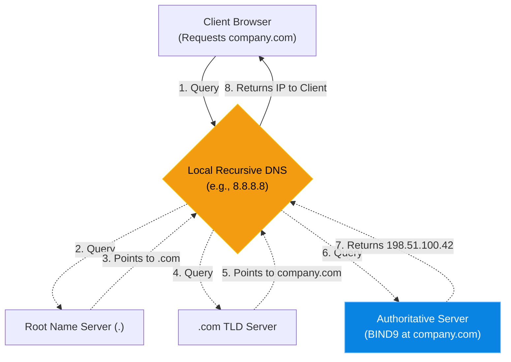

# Chapter 11 — The Domain Name System (BIND9)

## Learning Objectives

By the end of this chapter, you will be able to:
* Explain the difference between Recursive and Authoritative DNS.
* Identify standard DNS record types (A, CNAME, MX, TXT).
* Understand how the Time-To-Live (TTL) value affects caching.
* Use `dig` to troubleshoot DNS resolution issues and bypass local caches.

## Visual Architecture: The Global Phonebook

Humans are terrible at remembering numbers. You cannot expect a customer to remember that your web server is located at `198.51.100.42`. You expect them to remember `company.com`. 
The Domain Name System (DNS) is a globally distributed database that translates human-readable domain names into machine-readable IP addresses. 

## Theory & Concepts

### 1. Recursive vs. Authoritative
* **Authoritative DNS:** The server that *owns* the records. If you buy a domain name, you must configure an Authoritative DNS server (like AWS Route53, or a self-hosted Linux server running `BIND9`) to hold your records.
* **Recursive DNS:** The server that *searches* for the records. When you connect to Wi-Fi, your router assigns you a Recursive DNS server (like Google's `8.8.8.8` or Cloudflare's `1.1.1.1`). It does all the hard work of traversing the internet to find the Authoritative server.

### 2. Common Record Types
* **A Record:** (Address) Maps a name directly to an IPv4 address. (`app.company.com` -> `192.168.1.50`)
* **CNAME:** (Canonical Name) Maps a name to another name. Like an alias. (`www.company.com` -> `company.com`)
* **MX:** (Mail Exchange) Specifies which server handles incoming email for the domain.
* **TXT:** (Text) Used for verifying domain ownership and configuring email spam protections (SPF).

### 3. TTL (Time-To-Live)
Every DNS record has a TTL value, measured in seconds. If an A Record has a TTL of `86400` (24 hours), the Recursive server will cache that answer for 24 hours. If you change the IP address on your Authoritative server, anyone who queried the record yesterday will be sent to the *old* IP address until their cache expires.

> [!IMPORTANT]  
> **Best Practice: Pre-migration TTL Reduction**  
> If you know you are migrating a website to a new server this weekend, lower the TTL of the A Record from 86400 (24h) to 300 (5 minutes) on Wednesday. By Friday, all global caches will respect the 5-minute window. When you change the IP on Saturday, the "propagation delay" will only be 5 minutes instead of 24 hours!

## Scenario-Based Troubleshooting

### Scenario A: The Stale Cache
**The Incident:** A marketing team launches a highly anticipated redesign of the company homepage. The IT team changes the A Record from `Server A (Old)` to `Server B (New)`. 
However, chaos ensues. Half the company sees the new website. The other half sees the old website. A frustrated manager submits a ticket: "The DNS is broken. Please fix the propagation immediately."

**The Investigation & Fix:**

1. The Support Engineer knows that "DNS is broken" is almost never true. DNS is just doing exactly what it was told. 
2. The engineer uses the `dig` command from their own laptop to query the domain:
   `dig company.com`
3. The output shows the *old* IP address, and shows the TTL counting down: `company.com. 14400 IN A 198.51.100.10`. The local DNS cache still has 4 hours (14400 seconds) left before it will ask the Authoritative server for an update.
4. The engineer bypasses the local cache by using `dig` to ask the *Authoritative* server directly:
   `dig @ns1.company-authoritative.com company.com`
5. The Authoritative server responds with the *new* IP address. 
6. The engineer replies to the manager: "DNS is working perfectly. The record was changed successfully. However, the previous TTL was set to 24 hours. The internet is legally caching the old IP address. We cannot force global routers to clear their cache. We simply have to wait for the TTL to expire."

> [!TIP]
> **Senior Engineer Note**
> When troubleshooting The Domain Name System (BIND9) in production, never restart the service immediately. Restarts clear memory buffers, wipe temporary state, and destroy the exact evidence you need to find the root cause. Always capture logs (e.g., `journalctl` or container logs) *before* attempting a fix.

## Real-World Support Ticket

> [!IMPORTANT] ServiceNow Ticket: INC-3026311
> **Title:** DNS NXDOMAIN for Primary API
> **Assigned To:** Charlie (L2 Support Engineer)
> **Status:** IN PROGRESS
> 
> **1) Ticket intake & triage**
> Charlie receives a P1 alert: The mobile app cannot connect to `api.corp.com`.
> 
> **2) Discovery & diagnosis**
> Charlie runs `dig api.corp.com` and receives an `NXDOMAIN` (Non-Existent Domain) response. He checks the primary BIND server and sees a syntax error in the zone file loaded 10 minutes ago.
> 
> **3) Immediate containment**
> Charlie immediately rolls back the zone file to the previous version and runs `rndc reload` to restore service.
> 
> **4) Resolution planning & execution**
> Charlie reviews the broken zone file and finds a missing trailing dot on a CNAME record, which corrupted the entire zone. He fixes the typo.
> 
> **5) Verification**
> Charlie runs `named-checkzone` to verify the syntax, applies the change, and runs `dig` to confirm the IP resolves correctly.
> 
> **6) Closure & documentation**
> Charlie documents the missing trailing dot and resolves the ticket.
> 
> **7) Post-resolution follow-up**
> Charlie implements a git hook that automatically runs `named-checkzone` before allowing any engineer to commit changes to the DNS repository.
> 
> **8) Escalation rules**
> If the issue was a global root server problem, Charlie would escalate to the ISP.

## Industry Incident Spotlight: The 2021 Facebook BGP & DNS Outage

> [!CAUTION] **When You Delete Yourself From the Internet**
> In October 2021, Facebook, Instagram, and WhatsApp disappeared from the internet for over six hours.
>
> **The Timeline:**
> - During routine maintenance, an engineer issued a command intended to assess global backbone capacity.
> - A bug in an auditing tool allowed the command to execute incorrectly, cutting off all BGP routing between Facebook's data centers.
> - Because the BGP routes were withdrawn, the global internet could no longer reach Facebook's DNS servers.
>
> **The Root Cause:**
> Without DNS, nothing worked. Internal tools, employee door badges, and external routing all relied on the same unified network infrastructure, which had just effectively severed its own connections to the outside world.
>
> **The Business Impact:**
> Over $60 million in lost ad revenue and massive disruptions to global communications.
>
> **The Lessons Learned:**
> 1. **DNS is the Achilles Heel of the Internet.** If your DNS servers go down, it doesn't matter if your web servers are perfectly healthy.
> 2. Avoid circular dependencies. Facebook employees couldn't access the data centers to fix the issue because their digital door badges relied on the servers they were trying to fix.

## Real-World Support Ticket

> [!IMPORTANT] ServiceNow Ticket: INC-3026311
> **Title:** DNS NXDOMAIN for Primary API
> **Assigned To:** Charlie (L2 Support Engineer)
> **Status:** IN PROGRESS
> 
> **1) Ticket intake & triage**
> Charlie receives a P1 alert: The mobile app cannot connect to `api.corp.com`.
> 
> **2) Discovery & diagnosis**
> Charlie runs `dig api.corp.com` and receives an `NXDOMAIN` (Non-Existent Domain) response. He checks the primary BIND server and sees a syntax error in the zone file loaded 10 minutes ago.
> 
> **3) Immediate containment**
> Charlie immediately rolls back the zone file to the previous version and runs `rndc reload` to restore service.
> 
> **4) Resolution planning & execution**
> Charlie reviews the broken zone file and finds a missing trailing dot on a CNAME record, which corrupted the entire zone. He fixes the typo.
> 
> **5) Verification**
> Charlie runs `named-checkzone` to verify the syntax, applies the change, and runs `dig` to confirm the IP resolves correctly.
> 
> **6) Closure & documentation**
> Charlie documents the missing trailing dot and resolves the ticket.
> 
> **7) Post-resolution follow-up**
> Charlie implements a git hook that automatically runs `named-checkzone` before allowing any engineer to commit changes to the DNS repository.
> 
> **8) Escalation rules**
> If the issue was a global root server problem, Charlie would escalate to the ISP.

## Industry Incident Spotlight: The 2021 Facebook BGP & DNS Outage

> [!CAUTION] **When You Delete Yourself From the Internet**
> In October 2021, Facebook, Instagram, and WhatsApp disappeared from the internet for over six hours.
>
> **The Timeline:**
> - During routine maintenance, an engineer issued a command intended to assess global backbone capacity.
> - A bug in an auditing tool allowed the command to execute incorrectly, cutting off all BGP routing between Facebook's data centers.
> - Because the BGP routes were withdrawn, the global internet could no longer reach Facebook's DNS servers.
>
> **The Root Cause:**
> Without DNS, nothing worked. Internal tools, employee door badges, and external routing all relied on the same unified network infrastructure, which had just effectively severed its own connections to the outside world.
>
> **The Business Impact:**
> Over $60 million in lost ad revenue and massive disruptions to global communications.
>
> **The Lessons Learned:**
> 1. **DNS is the Achilles Heel of the Internet.** If your DNS servers go down, it doesn't matter if your web servers are perfectly healthy.
> 2. Avoid circular dependencies. Facebook employees couldn't access the data centers to fix the issue because their digital door badges relied on the servers they were trying to fix.

## Hands-on Lab

> [!TIP]
> **Practice Assignment Available**
> Proceed to the [Chapter 11 Practice Guide](../practice-files/V3-C11-practice.md) to use the `dig` command to trace DNS resolution and inspect TTL timers!

## Interview Questions

### Question 1: What is the difference between a Recursive DNS server and an Authoritative DNS server?
* **Target Answer**: "An Authoritative DNS server actually holds the official DNS records (Zone files) for a specific domain name; it provides the final answer. A Recursive DNS server (like Google's 8.8.8.8) doesn't own any records; its job is to accept a query from a client, traverse the DNS hierarchy to find the Authoritative server, fetch the answer, cache it, and return it to the client."

### Question 2: Why might a user see an old version of a website even after you have updated the A Record in your DNS provider?
* **Target Answer**: "This happens because of the Time-To-Live (TTL) value on the old DNS record. Recursive DNS servers and local web browsers cache DNS answers for the duration of the TTL to save bandwidth. If the old record had a TTL of 24 hours, the user will continue to be directed to the old IP address until their local cache expires and requests a fresh lookup."

### Question 3: What does the command `dig @8.8.8.8 example.com` do?
* **Target Answer**: "The `dig` command is a DNS lookup utility. The `@8.8.8.8` syntax tells `dig` to bypass the system's default DNS resolver (specified in `/etc/resolv.conf`) and instead send the query directly to Google's public DNS server at 8.8.8.8 to see how Google is resolving `example.com`."

## Common Mistakes & Pro-Tips

> [!WARNING] Common Mistake
> Forgetting to update the serial number in the SOA record. The secondary DNS servers will never pull the new records.

> [!CAUTION] Think Before You Type
> `systemctl restart named` (Did you run `named-checkzone` first?)

## Chapter Summary

"It's always DNS." This is the most famous joke in Systems Administration, because it is almost always true. If an application cannot find a database, or a user cannot load a website, your very first troubleshooting step should always be using `dig` to verify that the name is resolving to the correct IP address.

## Completion Checklist

- [ ] I understand how TTL dictates caching behavior.
- [ ] I know the difference between an A Record and a CNAME.
- [ ] I can use `dig @<server>` to query a specific DNS nameserver.

---

**Chapter Transition**
> DNS resolves the names, but how do our internal servers get their IP addresses in the first place?

---

**Chapter Transition**
> DNS resolves the names, but how do our internal servers get their IP addresses in the first place?

---

## Navigation

← Previous: [Chapter 10 — Database Backup & Restoration](V3-C10-database-backups.md)

↑ Volume Contents: [Table of Contents](TOC.md)

→ Next: [Chapter 12 — Dynamic Host Configuration (DHCPd)](V3-C12-dhcp.md)
