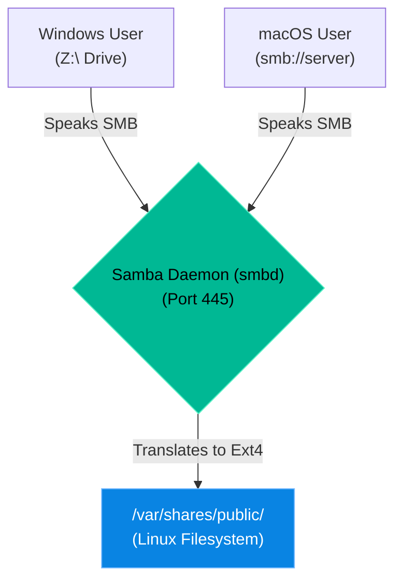

# Chapter 16 — Advanced File Sharing (Samba)


## Learning Objectives

By the end of this chapter, you will be able to:
* Explain the difference between NFS and SMB.
* Understand why Samba is necessary in mixed-OS environments.
* Configure a basic file share using `smb.conf`.
* Troubleshoot "Opportunistic Locks" (Oplocks) when Windows clients interfere with Linux scripts.

## Visual Architecture: The Cross-Platform Bridge

If you have a pure Linux network, you use NFS (Network File System) to share files. However, the real world is almost never pure Linux. 
The vast majority of office employees use Windows or macOS. Windows does not natively speak NFS; it speaks SMB (Server Message Block). **Samba** is a Linux daemon (`smbd`) that translates Linux files into the SMB protocol, allowing Windows and macOS users to seamlessly map network drives to your Linux servers.



## Theory & Concepts

### 1. The `smb.conf` File
The entire Samba server is controlled by a single file: `/etc/samba/smb.conf`. 
This file is divided into blocks. The `[global]` block controls the entire server (like what "Workgroup" it belongs to). Below that, you define individual "Shares".

```text
[Public]
   path = /var/shares/public
   browseable = yes
   read only = no
   guest ok = yes
```
In this example, anyone on the network can connect to `\\linux-server\Public` and have full read/write access without a password.

### 2. Samba Users vs. Linux Users
Samba security is notoriously confusing because it maintains its own separate password database. 
If you want an employee named "Alice" to access a private share, you must first create her Linux system account (`useradd alice`), and *then* you must add her to the Samba password database using `smbpasswd -a alice`. If her Linux password and her Samba password are out of sync, she will be denied access!

### 3. Opportunistic Locks (Oplocks)
When a Windows user opens an Excel file on a network share, Windows asks Samba for an "Oplock". This lock tells Samba: "I am actively editing this file. Do not let anyone else edit it, or we will corrupt the data." Samba honors this lock and blocks all other users (and Linux scripts!) from writing to the file until the Windows user closes it.

## Scenario-Based Troubleshooting

### Scenario A: The Locked File
**The Incident:** A financial analytics company has a Linux bash script that runs every night at 2:00 AM. It reads the day's sales data and overwrites a master CSV file located in a Samba share (`/var/shares/finance/master.csv`). 
For three days in a row, the script has failed with a `Permission denied` error. However, when the Support Engineer checks the file permissions using `ls -l`, the permissions are perfectly open (`chmod 777`).

**The Investigation & Fix:**

1. The engineer knows that standard Linux permissions (`rwx`) are not the only thing that can block a file.
2. The engineer runs the `smbstatus` command on the Linux server. This tool lists all active connections and locks on the Samba daemon.
3. The output shows that a Windows machine (`IP: 10.0.5.15`) currently holds an `EXCLUSIVE+BATCH` oplock on `master.csv`.
4. The engineer realizes the problem: An accountant is going home at 5:00 PM but leaving the Excel file open on their Windows desktop. Windows is keeping the oplock active all night, preventing the Linux bash script from modifying the file!
5. To permanently fix this, the engineer edits `/etc/samba/smb.conf`. They navigate to the `[Finance]` share and add a new line:
   `oplocks = False`
6. They reload the Samba daemon (`systemctl reload smbd`).
7. By disabling oplocks for this specific share, Windows is no longer allowed to exclusively lock the file. The script runs perfectly that night at 2:00 AM, even if the accountant leaves the file open.

> [!CAUTION]  
> **Best Practice: Disabling Oplocks**  
> Disabling oplocks solves automated scripting issues, but it introduces a new risk: if *two* accountants try to save the Excel file at the exact same millisecond, the file will become corrupted. Only disable oplocks on shares where automated Linux scripts are the primary writers, or where applications are designed to handle concurrent writes.

> [!TIP]
> **Senior Engineer Note**
> When troubleshooting Advanced File Sharing (Samba) in production, never restart the service immediately. Restarts clear memory buffers, wipe temporary state, and destroy the exact evidence you need to find the root cause. Always capture logs (e.g., `journalctl` or container logs) *before* attempting a fix.


## Hands-on Lab

> [!TIP]
> **Practice Assignment Available**
> Proceed to the [Chapter 16 Practice Guide](../practice-files/V3-C16-practice.md) to configure your own public Samba share and connect to it using the command-line!

## Interview Questions

### Question 1: What is the primary use-case for installing Samba instead of NFS?
* **Target Answer**: "NFS is excellent for Linux-to-Linux file sharing, but Windows and macOS do not natively support it well. Samba implements the SMB/CIFS protocol, which is the native file-sharing protocol for Windows. You install Samba when you need a Linux server to seamlessly share files and act as a file server for a mixed-OS environment."

### Question 2: A user has a valid Linux system account (`/etc/passwd`), but they keep receiving an 'Access Denied' error when trying to map a Samba network drive. What is the most likely cause?
* **Target Answer**: "Samba maintains its own internal password database, separate from standard Linux `/etc/shadow` passwords. Even if the user exists in Linux, they cannot authenticate to Samba until the administrator explicitly adds them to the Samba database using the `smbpasswd -a <username>` command."

### Question 3: An automated Linux script is failing to write to a file inside a Samba share, but the Linux `chmod` permissions are 777. What Samba feature is likely causing this?
* **Target Answer**: "The file is likely being locked by a Windows client using an 'Opportunistic Lock' (Oplock). When a Windows user leaves a file open, Samba honors the oplock and prevents any other process (including local Linux scripts) from writing to it. You can verify this using the `smbstatus` command, and you can prevent it by setting `oplocks = False` in the `smb.conf` share definition."

## Common Mistakes & Pro-Tips

> [!WARNING] Common Mistake
> Setting Samba permissions wide open (`guest ok = yes`) on a share containing HR documents.

> [!CAUTION] Think Before You Type
> `smbpasswd -a user` (Does the Linux user actually exist in `/etc/passwd`?)

## Chapter Summary

Samba is the ultimate diplomat. It allows Linux to integrate flawlessly into corporate environments dominated by Windows desktops. By understanding how `smb.conf` maps to Linux directories, and how Oplocks affect local processes, you can manage enterprise file servers with confidence.

## Completion Checklist

- [ ] I understand why SMB is used instead of NFS for office environments.
- [ ] I know that Samba requires a separate password database (`smbpasswd`).
- [ ] I understand how Windows Oplocks can interfere with local Linux scripts.

---

**Chapter Transition**
> With file sharing active, the number of logs being generated is overwhelming. We need a central location for them.

---


## Navigation

← Previous: [Chapter 15 — Virtual Private Networks (OpenVPN/WireGuard)](V3-C15-vpns.md)

↑ Volume Contents: [Table of Contents](TOC.md)

→ Next: [Chapter 17 — Centralized Logging (ELK Intro)](V3-C17-centralized-logging.md)
