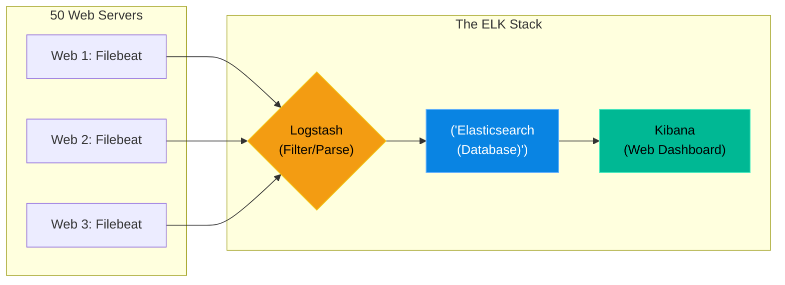

# Chapter 17 — Centralized Logging (ELK Intro)

## Learning Objectives

By the end of this chapter, you will be able to:
* Explain why centralized logging is mandatory in load-balanced environments.
* Understand the architecture of the ELK Stack (Elasticsearch, Logstash, Kibana).
* Understand the role of a log forwarder (Filebeat).
* Differentiate between unstructured text logs and structured JSON logs.

## Visual Architecture: The ELK Stack

If you have a single web server, finding an error is easy: `cat /var/log/nginx/error.log`. 
If you have 50 web servers sitting behind a load balancer, finding an error is impossible. You cannot SSH into 50 different servers to run `grep`. 
Instead, we install a tiny "forwarder" on all 50 servers. This forwarder watches the log files and streams every new line to a centralized database. You then use a beautiful web interface to search the logs of all 50 servers simultaneously.

## Theory & Concepts

### 1. The ELK Stack Components
* **Filebeat:** A lightweight agent installed on the web servers. Its only job is to read `/var/log/*` and ship the text over the network.
* **Logstash (or Fluentd):** The processor. It receives raw text from Filebeat, rips it apart using Regex, extracts the IP addresses and error codes, and formats it cleanly.
* **Elasticsearch:** The database. It is a NoSQL search engine specifically designed to index billions of text documents instantly.
* **Kibana:** The visualization layer. A web dashboard where the Support Engineer types `error_code: 500` into a search bar and instantly sees the results from Elasticsearch.

### 2. Structured vs. Unstructured Logs
Historically, applications wrote "Unstructured" logs: 
`[2026-07-08 14:32:01] ERROR: User Alice failed to login from 192.168.1.5`
To extract the IP address, Logstash must run complex Regex queries, which is slow and prone to breaking if the developer changes the sentence structure.

> [!IMPORTANT]  
> **Best Practice: Structured JSON Logging**  
> Modern applications should never write sentences. They should write "Structured" JSON logs: 
> `{"time": "2026-07-08", "level": "ERROR", "user": "Alice", "ip": "192.168.1.5"}`. 
> Because this is JSON, Logstash doesn't need Regex. It can instantly parse the keys and values perfectly every time!

## Scenario-Based Troubleshooting

### Scenario A: The Needle in the Haystack
**The Incident:** A VIP customer calls the helpdesk. They tried to process a $10,000 transaction at exactly 14:32, but the website crashed. The infrastructure team has 10 NGINX web servers behind a load balancer. Nobody knows which specific server the VIP customer was routed to, making it impossible to check the `/var/log/nginx/error.log` file.

**The Investigation & Fix:**

1. The Support Engineer does not panic. They do not SSH into any of the 10 web servers.
2. The engineer opens the centralized **Kibana** web dashboard.
3. They set the time filter in Kibana to look strictly between `14:30` and `14:35`.
4. They know the VIP customer's email address. Because the application uses Structured JSON logging, the engineer simply types the following query into the Kibana search bar:
   `user_email: "vip@customer.com" AND log_level: "ERROR"`
5. Kibana queries the Elasticsearch database. Out of the 4 million log lines generated in those 5 minutes across all 10 servers, Kibana instantly returns exactly 1 result.
6. The result shows that the error occurred on `Web Server #7`.
7. The engineer expands the JSON document in Kibana and reads the exact Python stack trace: `ValueError: Invalid currency format`.
8. The engineer sends the stack trace to the developers. The issue was investigated and solved in 3 minutes without a single SSH connection.

> [!TIP]
> **Senior Engineer Note**
> When troubleshooting Centralized Logging (ELK Intro) in production, never restart the service immediately. Restarts clear memory buffers, wipe temporary state, and destroy the exact evidence you need to find the root cause. Always capture logs (e.g., `journalctl` or container logs) *before* attempting a fix.

## Hands-on Lab

> [!TIP]
> **Practice Assignment Available**
> Proceed to the [Chapter 17 Practice Guide](../practice-files/V3-C17-practice.md) to practice reading and filtering Structured JSON logs using the `jq` command-line tool!

## Interview Questions

### Question 1: In a load-balanced environment with 20 application servers, why is centralized logging considered a mandatory requirement?
* **Target Answer**: "When a user connects to a load balancer, their request could be routed to any of the 20 backend servers. If that user experiences an error, it is completely unfeasible for a Support Engineer to SSH into 20 different servers and manually `grep` 20 different log files to find the error. Centralized logging streams all logs from all servers into a single, searchable database, allowing engineers to find the error instantly regardless of which server generated it."

### Question 2: Briefly explain the roles of Elasticsearch, Logstash, and Kibana in the ELK stack.
* **Target Answer**: "Logstash is the data processing pipeline; it ingests raw logs from various servers, parses them, and transforms them into a structured format. Elasticsearch is the NoSQL database and search engine that stores the processed logs and indexes them for incredibly fast retrieval. Kibana is the graphical web interface that sits on top of Elasticsearch, allowing users to search the logs and build visual dashboards."

### Question 3: Why is 'Structured Logging' (like writing logs in JSON format) preferred over traditional plain-text logging?
* **Target Answer**: "Traditional plain-text logs require complex and fragile Regular Expressions (Regex) to parse and extract valuable data (like IP addresses or User IDs) inside Logstash. If a developer changes the wording of the log message, the Regex breaks. Structured Logging (JSON) outputs data in strict key-value pairs (e.g., `{"ip": "10.0.0.1"}`). This allows Logstash to parse the data natively, perfectly, and instantly, with zero risk of breakage."

## Common Mistakes & Pro-Tips

> [!WARNING] Common Mistake
> Forwarding debug-level logs to the central logging server, overwhelming the network and filling up the disk in hours.

> [!CAUTION] Think Before You Type
> `logger 'Test message'` (Did you check which facility and severity it was sent to?)

## Chapter Summary

As you scale from 1 server to 100 servers, your administrative tools must scale with you. Centralized logging ensures that your Mean Time To Recovery (MTTR) remains at 5 minutes, whether you are managing a single Raspberry Pi or a massive cloud cluster.

## Completion Checklist

- [ ] I understand why SSH and `grep` are insufficient for large clusters.
- [ ] I can explain the individual components of ELK (Elasticsearch, Logstash, Kibana).
- [ ] I understand the superiority of Structured JSON logs over raw text.

---

**Chapter Transition**
> Logs tell us what happened *in the past*, but how do we know if the server is crashing *right now*?

---

## Navigation

← Previous: [Chapter 16 — Advanced File Sharing (Samba)](V3-C16-samba-filesharing.md)

↑ Volume Contents: [Table of Contents](TOC.md)

→ Next: [Chapter 18 — Application Performance Monitoring (Prometheus)](V3-C18-monitoring-prometheus.md)
