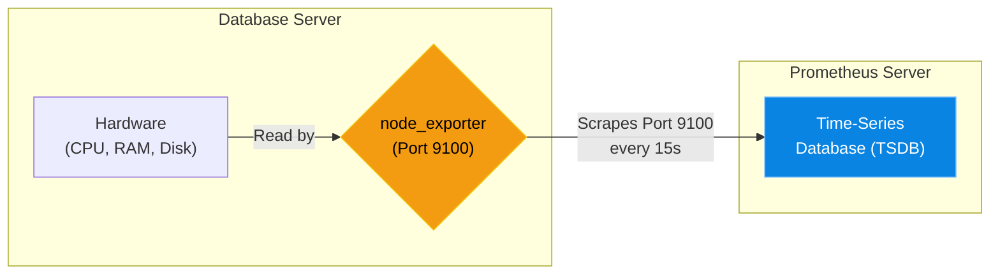

# Chapter 18 — Application Performance Monitoring (Prometheus)

## Learning Objectives

By the end of this chapter, you will be able to:
* Differentiate between Logs and Metrics.
* Understand the "Pull" architecture of Prometheus.
* Install and query the `node_exporter` daemon.
* Explain the concept of a Time-Series Database (TSDB).

## Visual Architecture: The Exporter and the Scraper

Logs are text (e.g., "User Alice logged in"). **Metrics** are numbers (e.g., "CPU is at 42%"). 
To get hardware numbers out of a Linux server, we install a tiny daemon called `node_exporter`. It runs on Port 9100 and creates a webpage (`/metrics`) containing thousands of numbers. 
A centralized server running **Prometheus** (a Time-Series Database) reaches out over the network every 15 seconds to "scrape" (download) that webpage and stores the numbers in its database.

## Theory & Concepts

### 1. Pull vs. Push Architecture
Most old monitoring systems (like Nagios) used a "Push" architecture: the agent on the server pushed its status to the central server. 
Prometheus uses a **Pull** architecture. The agents (`node_exporter`) do absolutely nothing except host a static webpage. The central Prometheus server is responsible for actively reaching out and "pulling" the data. 

> [!IMPORTANT]  
> **Best Practice: The Pull Advantage**  
> Pull architecture is superior for massive environments. If the central Prometheus server crashes, the individual agents don't suddenly overwhelm the network trying to push data to a dead server. Furthermore, because Prometheus reaches out to the agents, it instantly knows if a server is offline because the HTTP request will time out!

### 2. Time-Series Databases (TSDB)
Standard relational databases (MySQL) are terrible at storing metrics because you are inserting a new CPU percentage every 15 seconds, forever. 
A Time-Series Database is highly optimized to store nothing but `(Timestamp, Value)` pairs, allowing it to efficiently store years of metric data without slowing down.

### 3. Exporters
Prometheus can monitor anything, as long as there is an "Exporter" for it. 
* `node_exporter`: Exports Linux hardware metrics (CPU, RAM, Disk).
* `mysqld_exporter`: Exports database metrics (Queries per second).
* `nginx-prometheus-exporter`: Exports web server metrics (Active connections).

## Scenario-Based Troubleshooting

### Scenario A: The Silent Disk Full
**The Incident:** At 4:00 AM on a Sunday, the production database server crashes. The company loses 4 hours of sales before the team wakes up and discovers the issue: the `/var` partition hit 100% disk usage, causing MariaDB to instantly panic and shut down. 

**The Investigation & Fix:**

1. The Support Engineer fixes the immediate issue by deleting old log files, but the CTO demands a permanent solution so it never happens again. "Why didn't we know the disk was filling up?!"
2. The engineer implements Prometheus. They install the `node_exporter` daemon on the database server. 
3. The exporter begins hosting hardware metrics on `http://db-server:9100/metrics`.
4. The engineer configures the central Prometheus server to scrape that URL every 15 seconds.
5. In Prometheus, the engineer writes a PromQL (Prometheus Query Language) alert rule:
   `node_filesystem_free_bytes < 5000000000` (Alert me if free disk space drops below 5 Gigabytes).
6. Six months later, the disk begins to fill up again. When it hits 5.1GB remaining, Prometheus triggers an alert to the engineer's phone.
7. The engineer safely expands the disk *before* it hits 100%. The company never experiences a silent outage again.

> [!TIP]
> **Senior Engineer Note**
> When troubleshooting Application Performance Monitoring (Prometheus) in production, never restart the service immediately. Restarts clear memory buffers, wipe temporary state, and destroy the exact evidence you need to find the root cause. Always capture logs (e.g., `journalctl` or container logs) *before* attempting a fix.

## Hands-on Lab

> [!TIP]
> **Practice Assignment Available**
> Proceed to the [Chapter 18 Practice Guide](../practice-files/V3-C18-practice.md) to install `node_exporter` and use `curl` to view raw metrics!

## Interview Questions

### Question 1: What is the difference between Logs (ELK Stack) and Metrics (Prometheus)?
* **Target Answer**: "Logs are textual records of discrete events that have already occurred, like 'User logged in' or 'Database query failed'. Metrics are quantitative, numeric measurements of system states over time, such as 'CPU usage is at 45%' or 'Available RAM is 2GB'. Logs tell you *what* happened; Metrics tell you *how* the system is performing overall."

### Question 2: Explain the 'Pull' architecture of Prometheus.
* **Target Answer**: "In a Pull architecture, the monitored servers do not proactively send their data anywhere. Instead, they run an agent (like `node_exporter`) that simply exposes the raw metric data on a local HTTP webpage (e.g., Port 9100). The central Prometheus server is configured to actively connect to that webpage at scheduled intervals (e.g., every 15 seconds) to 'pull' or scrape the data back to its central database."

### Question 3: What is a Time-Series Database (TSDB), and why is it necessary for Prometheus?
* **Target Answer**: "A Time-Series Database is a database specifically optimized for storing data where time is the primary axis. When scraping 50 servers every 15 seconds for thousands of metrics, a standard relational database like MySQL would be crushed under the write-load. A TSDB efficiently stores millions of `[Timestamp, Value]` pairs, allowing for rapid ingestion and incredibly fast graph generation."

## Common Mistakes & Pro-Tips

> [!WARNING] Common Mistake
> Scraping metrics every 1 second from hundreds of targets. Prometheus will run out of memory and crash.

> [!CAUTION] Think Before You Type
> `systemctl restart prometheus` (Did you validate the YAML syntax? Prometheus will refuse to start if there's a single extra space.)

## Chapter Summary

Monitoring is the difference between being a reactive sysadmin and a proactive engineer. By installing exporters and aggregating metrics into a Time-Series Database, you grant yourself the superpower of seeing outages before they actually occur.

## Completion Checklist

- [ ] I understand the difference between Logs and Metrics.
- [ ] I can explain why Prometheus uses a Pull architecture.
- [ ] I know that `node_exporter` is used to expose hardware metrics.

---

**Chapter Transition**
> Prometheus is collecting metrics, but staring at raw numbers is inefficient. We need dashboards.

---

## Navigation

← Previous: [Chapter 17 — Centralized Logging (ELK Intro)](V3-C17-centralized-logging.md)

↑ Volume Contents: [Table of Contents](TOC.md)

→ Next: [Chapter 19 — Data Visualization (Grafana)](V3-C19-visualization-grafana.md)
