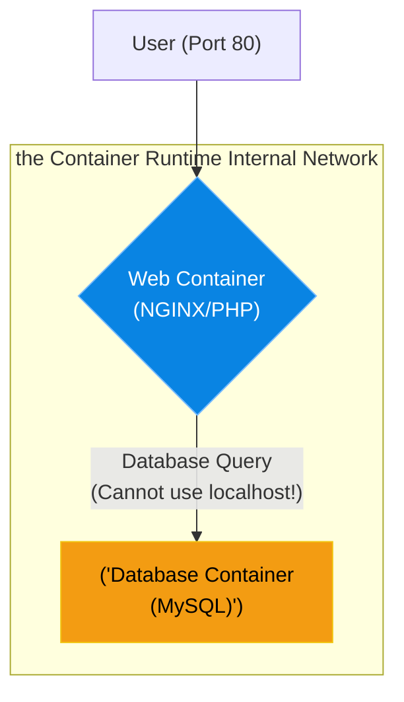

# Chapter 23 — Multi-Container Apps (the Container Runtime Compose)


## Learning Objectives

By the end of this chapter, you will be able to:
* Explain the Microservices architecture philosophy.
* Understand the Container Runtime's internal networking and DNS resolution.
* Explain why `localhost` inside a container does not reach other containers.
* Write a `docker-compose.yml` file to orchestrate multiple containers.

## Visual Architecture: Microservices

When you used a Virtual Machine, you installed Apache, PHP, and MySQL all on the same operating system. This is a "Monolith". 
In the container world, we use "Microservices". A container should do *one* thing. If you want a database and a web server, you do not cram them into one container. You run a Web Container and a Database Container, and you connect them via a virtual network.



## Theory & Concepts

### 1. The Container Runtime Compose
Running one container with `docker run -d -p 80:80 my-image` is easy. But what if you have an application that requires a Web container, a Redis cache container, and a Postgres container? 
Typing 3 massive `docker run` commands manually is terrible. 
**the Container Runtime Compose** allows you to define all 3 containers in a single YAML file (`docker-compose.yml`). You simply type `docker compose up -d`, and it builds the network and starts all the containers in the correct order.

### 2. The Localhost Trap
Because containers use Namespaces (from Chapter 21) to isolate their network stack, a container believes it is the only computer on the planet. 
If a PHP application inside the Web container tries to connect to a database at `localhost:3306`, the connection will fail. `localhost` inside the Web container means the Web container itself! 

### 3. Internal DNS Resolution
When you use the Container Runtime Compose, it automatically creates a virtual network and attaches all your containers to it. Furthermore, it creates a DNS server. 
If you name your database service `db` in the `docker-compose.yml` file, the Container Runtime Compose ensures that if the Web container pings `db`, it magically resolves to the Database container's internal IP address!

## Scenario-Based Troubleshooting

### Scenario A: The Missing Link
**The Incident:** A junior developer is trying to run a new WordPress environment locally. They run a WordPress container and a MySQL container using two separate `docker run` commands. 
The WordPress installation screen throws an error: `Error establishing a database connection.` 
The developer is confused. "I configured WordPress to connect to `localhost:3306`, and the database is definitely running! Why can't they talk?"

**The Investigation & Fix:**

1. The Support Engineer explains the Localhost Trap. The WordPress container is checking its own internal loopback interface for MySQL, but MySQL is in a totally separate container namespace.
2. The engineer explains that instead of running manual commands, they should write a `docker-compose.yml` file.
3. The engineer writes the file:
   ```yaml
   version: '3.8'
   services:
     wordpress:
       image: wordpress:latest
       ports:
         - "8080:80"
       environment:
         WORDPRESS_DB_HOST: mysql_db
         WORDPRESS_DB_PASSWORD: supersecret
     
     mysql_db:
       image: mysql:8.0
       environment:
         MYSQL_ROOT_PASSWORD: supersecret
   ```
4. Notice that `WORDPRESS_DB_HOST` is set to `mysql_db` (the exact name of the other service), NOT `localhost`!
5. The engineer runs `docker compose up -d`. 
6. The Container Runtime creates a virtual network, attaches both containers, and configures the internal DNS. When WordPress asks "Where is `mysql_db`?", the Container Runtime routes it perfectly to the MySQL container. The site installs successfully.

> [!TIP]
> **Senior Engineer Note**
> When troubleshooting Multi-Container Apps (the Container Runtime Compose) in production, never restart the service immediately. Restarts clear memory buffers, wipe temporary state, and destroy the exact evidence you need to find the root cause. Always capture logs (e.g., `journalctl` or container logs) *before* attempting a fix.


## Real-World Support Ticket

> [!IMPORTANT] ServiceNow Ticket: INC-3026323
> **Title:** Database Connection Failure in Docker Compose
> **Assigned To:** Charlie (L2 Support Engineer)
> **Status:** IN PROGRESS
> 
> **1) Ticket intake & triage**
> Charlie takes a P2 ticket: The newly deployed staging environment via Docker Compose is failing to start.
> 
> **2) Discovery & diagnosis**
> Charlie runs `docker-compose logs web` and sees `Host not found: db`. He checks `docker-compose.yml` and notices the web service and the database service are on entirely different custom bridge networks.
> 
> **3) Immediate containment**
> Charlie stops the broken deployment (`docker-compose down`) to free up the ports.
> 
> **4) Resolution planning & execution**
> Charlie edits the `docker-compose.yml` file, moving both services to the same custom bridge network so Docker's internal DNS can resolve the service names.
> 
> **5) Verification**
> Charlie runs `docker-compose up -d` and watches the logs. The web service successfully connects to the database.
> 
> **6) Closure & documentation**
> Charlie documents the network isolation issue and resolves the ticket.
> 
> **7) Post-resolution follow-up**
> Charlie adds a network validation step to the CI/CD pipeline.
> 
> **8) Escalation rules**
> If the container kept crashing silently without logs, Charlie would escalate to the application developers to add debug logging.


## Real-World Support Ticket

> [!IMPORTANT] ServiceNow Ticket: INC-3026323
> **Title:** Database Connection Failure in Docker Compose
> **Assigned To:** Charlie (L2 Support Engineer)
> **Status:** IN PROGRESS
> 
> **1) Ticket intake & triage**
> Charlie takes a P2 ticket: The newly deployed staging environment via Docker Compose is failing to start.
> 
> **2) Discovery & diagnosis**
> Charlie runs `docker-compose logs web` and sees `Host not found: db`. He checks `docker-compose.yml` and notices the web service and the database service are on entirely different custom bridge networks.
> 
> **3) Immediate containment**
> Charlie stops the broken deployment (`docker-compose down`) to free up the ports.
> 
> **4) Resolution planning & execution**
> Charlie edits the `docker-compose.yml` file, moving both services to the same custom bridge network so Docker's internal DNS can resolve the service names.
> 
> **5) Verification**
> Charlie runs `docker-compose up -d` and watches the logs. The web service successfully connects to the database.
> 
> **6) Closure & documentation**
> Charlie documents the network isolation issue and resolves the ticket.
> 
> **7) Post-resolution follow-up**
> Charlie adds a network validation step to the CI/CD pipeline.
> 
> **8) Escalation rules**
> If the container kept crashing silently without logs, Charlie would escalate to the application developers to add debug logging.


## Hands-on Lab

> [!TIP]
> **Practice Assignment Available**
> Proceed to the [Chapter 23 Practice Guide](../practice-files/V3-C23-practice.md) to use the Container Runtime Compose to stand up a WordPress/MariaDB stack in one command!

## Interview Questions

### Question 1: What is the primary purpose of the Container Runtime Compose?
* **Target Answer**: "the Container Runtime Compose is an orchestration tool for defining and running multi-container applications. Instead of running multiple complex `docker run` commands manually, you define your services, networks, and volumes in a single `docker-compose.yml` file, allowing you to spin up the entire application stack with a single command."

### Question 2: Why should you never run a Web Server and a Database Server inside the same the Container Runtime container?
* **Target Answer**: "Containers are designed to follow the Microservices philosophy: one process per container. If you run both services in one container, it becomes a 'Monolith'. You cannot scale the web server independently of the database, you cannot easily update one without taking down the other, and if one process crashes, the entire container fails."

### Question 3: A web container is trying to connect to a database container. The web container's configuration file is set to connect to `localhost:5432`. Why will this fail, and how do you fix it using the Container Runtime Compose?
* **Target Answer**: "It will fail because of network isolation (Namespaces). To a container, `localhost` means its own internal loopback interface, not the host machine or other containers. To fix it, you write a `docker-compose.yml` file, defining the database service with a name (e.g., `db`). The Container Runtime Compose's internal DNS will automatically resolve that service name. You then change the web container's configuration to connect to `db:5432` instead of `localhost`."

## Common Mistakes & Pro-Tips

> [!WARNING] Common Mistake
> Hardcoding IP addresses in `docker-compose.yml` instead of relying on the internal Docker DNS resolver.

> [!CAUTION] Think Before You Type
> `docker-compose down -v` (Did you just delete the named volumes and all the database data?)

## Chapter Summary

the Container Runtime Compose is the absolute standard for local development. By mastering the `docker-compose.yml` file, you can hand any developer a single file that guarantees their application will boot perfectly with all required databases and caches attached.

## Completion Checklist

- [ ] I understand the Microservices philosophy.
- [ ] I understand why `localhost` fails between containers.
- [ ] I can explain how the Container Runtime internal DNS maps service names to containers.

---

**Chapter Transition**
> The containers are running, but what happens to the database when the container stops? We need persistence.

---

**Chapter Transition**
> The containers are running, but what happens to the database when the container stops? We need persistence.

---


## Navigation

← Previous: [Chapter 22 — Building Container Images (Dockerfiles)](V3-C22-building-images.md)

↑ Volume Contents: [Table of Contents](TOC.md)

→ Next: [Chapter 24 — Persistent Data & Networking](V3-C24-persistent-data.md)
