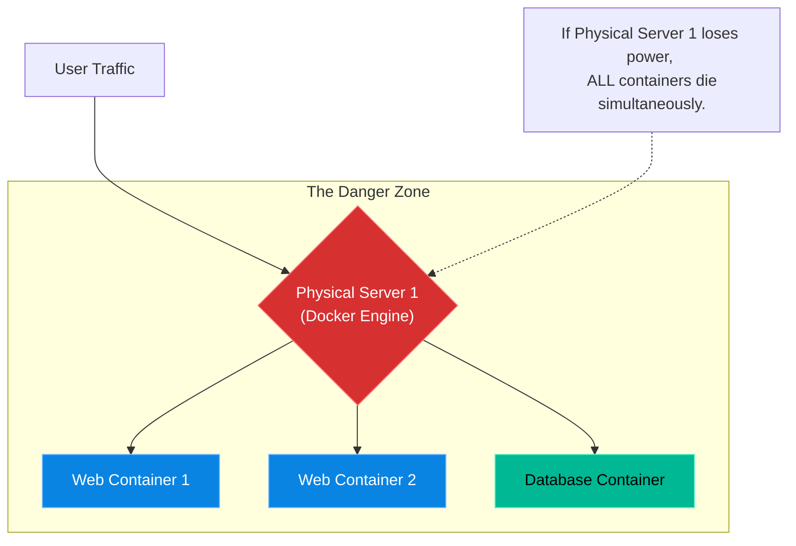

# Chapter 25 — Introduction to Orchestration (K8s Prep)

## Learning Objectives

By the end of this chapter, you will be able to:
* Identify the Single Point of Failure in a Docker Compose architecture.
* Explain the concept of Container Orchestration.
* Understand the core promises of Kubernetes (High Availability, Auto-Scaling, Self-Healing).
* Prepare for the architectural shift required in Volume 4.

## Visual Architecture: The Single Point of Failure

Throughout Volume 3, you have mastered Linux services, databases, networking, and Docker Compose. You are now a highly capable Mid-Level Support Engineer. 
However, Docker Compose has a fatal flaw: it operates on a single server. 
If you have 10 microservices running flawlessly via `docker-compose.yml`, and the motherboard on that physical server dies, your entire company goes offline. This is called a **Single Point of Failure**.

## Theory & Concepts

### 1. What is Orchestration?
To achieve true 99.99% uptime, you cannot run your application on one server. You must buy 3 servers, install Docker on all of them, and tie them together into a "Cluster". 
An **Orchestrator** is a piece of software that manages the cluster. You tell the Orchestrator: "I need 5 Web Containers." The Orchestrator looks at the cluster and decides to put 2 containers on Server A, 2 on Server B, and 1 on Server C. 

### 2. Self-Healing
If Server B suddenly loses power, 2 Web Containers instantly die. A traditional sysadmin's pager would go off at 3:00 AM, forcing them to wake up and manually restart the containers on Server A.
An Orchestrator detects the dead server, realizes there are only 3 Web Containers running (but you asked for 5), and automatically spins up 2 new containers on Server A within seconds. The sysadmin sleeps through the night.

### 3. Kubernetes (K8s)
While there are many orchestrators (Docker Swarm, HashiCorp Nomad), **Kubernetes** has won the container war. It was originally built by Google to manage their billions of containers. 
In Volume 4, you will abandon `docker-compose.yml` and learn to write Kubernetes Manifests to deploy highly available, self-healing applications across massive enterprise clusters.

## Scenario-Based Troubleshooting

### Scenario A: The Single Point of Failure
**The Incident:** A startup company is featured on the front page of Reddit. Massive traffic floods their servers. The CTO used Docker Compose to deploy the application on a single massive AWS EC2 instance. 
The immense traffic causes the Docker daemon to panic and crash. All 50 microservices die instantly. The company loses thousands of dollars in sales while the CTO frantically tries to reboot the server. 

**The Investigation & Fix:**

1. The Support Engineer (You) is hired the next day to fix the architecture.
2. The CTO says, "We need a bigger server! 128GB of RAM!"
3. The engineer shakes their head. "A bigger server is just a bigger Single Point of Failure. If a 128GB server crashes, we still go offline."
4. The engineer designs a Kubernetes architecture. They provision three smaller, cheaper 16GB servers. 
5. They deploy the Kubernetes Control Plane.
6. They configure an Auto-Scaler. When the next Reddit spike hits, Kubernetes automatically detects the high CPU load, provisions a 4th server, and spins up 10 new Web Containers to handle the traffic. When the traffic subsides, Kubernetes destroys the 4th server to save money.
7. **The Result:** The startup never experiences a total outage again. The engineer is promoted to Senior Cloud Architect.

> [!CAUTION]  
> **Best Practice: Do Not Over-Engineer**  
> Kubernetes is incredibly complex. It requires dedicated engineers to maintain. If you are running a small internal wiki for 10 employees, Docker Compose is perfect. Do not introduce Kubernetes into a business architecture unless the business requirements (like 99.99% uptime and auto-scaling) strictly demand it.

> [!TIP]
> **Senior Engineer Note**
> When troubleshooting Introduction to Orchestration (K8s Prep) in production, never restart the service immediately. Restarts clear memory buffers, wipe temporary state, and destroy the exact evidence you need to find the root cause. Always capture logs (e.g., `journalctl` or container logs) *before* attempting a fix.

## Hands-on Lab

> [!TIP]
> **Practice Assignment Available**
> Proceed to the [Chapter 25 Practice Guide](../practice-files/V3-C25-practice.md) to conceptually audit a single-node architecture and identify the points of failure!

## Interview Questions

### Question 1: What is a Single Point of Failure (SPOF) in the context of Docker Compose?
* **Target Answer**: "Docker Compose is designed to orchestrate containers on a single host machine (a single Docker Engine). Therefore, the underlying host machine is a Single Point of Failure. If that physical server suffers a hardware failure, power loss, or kernel panic, all containers defined in the `docker-compose.yml` file will go offline simultaneously, resulting in a total application outage."

### Question 2: Explain the concept of 'Self-Healing' in a Container Orchestrator like Kubernetes.
* **Target Answer**: "Self-healing is the orchestrator's ability to automatically recover from failures without human intervention. The orchestrator constantly monitors the 'Desired State' (e.g., 'I want 5 NGINX containers running'). If a hardware node crashes and takes down 2 of those containers, the orchestrator detects the discrepancy between the desired state and the actual state, and immediately provisions 2 replacement containers on healthy nodes in the cluster."

### Question 3: Why shouldn't every company immediately migrate all their applications from Docker Compose to Kubernetes?
* **Target Answer**: "Kubernetes introduces massive operational complexity, requiring specialized knowledge to manage the Control Plane, Ingress controllers, and RBAC security. For simple, low-traffic applications, or internal tools where a few minutes of downtime is acceptable, Docker Compose is vastly simpler and cheaper to maintain. Kubernetes should only be adopted when the business requirements explicitly demand high availability, zero-downtime deployments, and horizontal auto-scaling."

## Common Mistakes & Pro-Tips

> [!WARNING] Common Mistake
> Trying to manually manage 100 containers across 10 hosts using Docker CLI instead of moving to an orchestrator like Kubernetes.

> [!CAUTION] Think Before You Type
> `docker swarm init` (Are you prepared for the complexity of distributed state?)

## Chapter Summary

Congratulations! You have completed Volume 3. You have evolved from executing basic Linux commands to designing decoupled, containerized microservices. Take a deep breath. In Volume 4, we will take these isolated containers and wire them together into massive, self-healing Kubernetes clusters.

## Completion Checklist

- [ ] I understand the limitations of Docker Compose in production.
- [ ] I understand the core concepts of Orchestration (Self-Healing, Auto-Scaling).
- [ ] I am ready to begin Volume 4!

---

**Chapter Transition**
> Congratulations on completing Volume 3. Next up: Volume 4 - Enterprise Infrastructure.

---

**Chapter Transition**
> Congratulations on completing Volume 3. Next up: Volume 4 - Enterprise Infrastructure.

---

## Navigation

← Previous: [Chapter 24 — Persistent Data & Networking](V3-C24-persistent-data.md)

↑ Volume Contents: [Table of Contents](TOC.md)

→ Next: None
