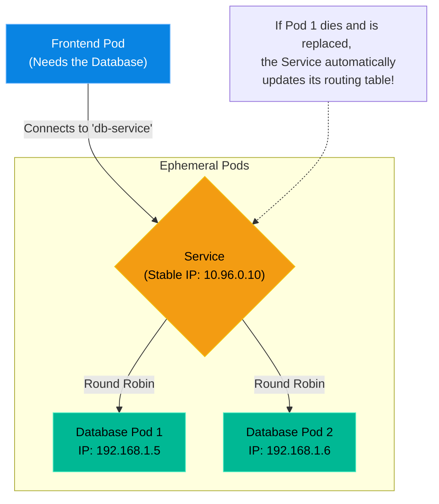

# Chapter 3 — Kubernetes Networking

## Learning Objectives

Without networking, a cluster is just a group of isolated containers. In this chapter, we unravel the magic of Services and Ingress, showing how external traffic securely reaches your internal Pods.

By the end of this chapter, you will be able to:
* Explain why Pod IP addresses should never be hardcoded.
* Differentiate between ClusterIP, NodePort, and LoadBalancer Services.
* Understand how Kube-proxy routes traffic using Labels and Selectors.
* Explain the role of an Ingress Controller (Layer 7 Routing).

## Visual Architecture: The Kubernetes Service

Because Pods are ephemeral, their internal IP addresses change constantly. If Pod A dies, the ReplicaSet creates Pod B, and Pod B will have a completely different IP address. 
To solve this, Kubernetes uses an abstraction called a **Service**. A Service provides a permanent, unchanging IP address and a permanent DNS name. It sits in front of your Pods and acts as an internal load balancer.

## Theory & Concepts

### 1. Service Types (Layer 4)
When you create a Service YAML, you must define its `type`.
* **ClusterIP (Default):** Exposes the Service on a cluster-internal IP. Choosing this makes the Service only reachable from *within* the cluster. This is perfect for Databases.
* **NodePort:** Exposes the Service on each Worker Node's IP at a static port (between 30000-32767). You can hit `http://<NodeIP>:<NodePort>` from outside the cluster. 
* **LoadBalancer:** The standard for cloud environments (AWS/GCP). It automatically provisions a massive cloud Load Balancer and routes external internet traffic into your cluster.

### 2. Labels and Selectors
How does the Service know which Pods belong to it? It does not use IP addresses. It uses **Labels**. 
If you label your Pods with `app: backend`, you simply configure the Service's `selector` to look for `app: backend`. The `kube-proxy` daemon on each node constantly updates the routing tables (using `iptables` or `IPVS`) to ensure traffic hitting the Service is perfectly load-balanced across all matching Pods.

### 3. Ingress (Layer 7)
A LoadBalancer Service works at Layer 4 (TCP/UDP). It cannot look at the URL. If you have `api.company.com` and `store.company.com`, you would have to buy two expensive cloud LoadBalancers!
An **Ingress** operates at Layer 7 (HTTP). It allows you to buy exactly *one* LoadBalancer, route all internet traffic to the Ingress Controller, and let the Ingress route traffic to different internal Services based on the URL path or hostname.

## Scenario-Based Troubleshooting

### Scenario A: The IP Shuffle

> [!IMPORTANT]  
> **Incident Report: The IP Shuffle**  
> **Reporter:** Automated Monitoring  
> **SOP execution:**
>
>
> 1. **16:00 PM — Incident Receipt:** Python Backend throws `Connection Refused` when reaching Redis.
>
> 2. **16:02 PM — Triage & Containment:** The engineer verifies the Redis Pod is running, but the backend is trying to reach a dead IP `192.168.1.45`.
>
> 3. **16:05 PM — Investigation:** A node was rebooted two hours ago. Kubernetes rescheduled the Redis Pod to a new node, assigning it a new ephemeral IP `192.168.2.100`. The junior developer had hardcoded the old Pod IP in the backend config.
>
> 4. **16:08 PM — Root Cause:** Hardcoded ephemeral Pod IPs instead of using a stable Kubernetes Service.
>
> 5. **16:10 PM — Resolution:** The engineer writes a `ClusterIP` Service named `redis-cache-svc`. The developer updates the Python code to use `redis://redis-cache-svc:6379`.
>
> 6. **16:12 PM — Verification:** CoreDNS resolves the name correctly. The application connects. Total downtime: 12 minutes.
>
> 7. **Post-Mortem:** Educate developers on Pod ephemerality and Service discovery.
>
> 8. **Documentation:** Update onboarding wiki to mandate Service names for all internal communication.

> [!CAUTION]  
> **Best Practice: Never Expose Databases Externally**  
> Never create a `NodePort` or `LoadBalancer` Service for a Database deployment. Databases should *only* ever use `ClusterIP`. Only your web servers/APIs should be reachable from the outside internet. Security requires a strict boundary between public traffic and internal state.

## Hands-on Lab

> [!TIP]
> **Practice Assignment Available**
> Proceed to the [Chapter 3 Practice Guide](../practice-files/V4-C03-practice.md) to create a Service and prove that internal DNS works across isolated Pods!

## Interview Questions

### Question 1: What is the primary problem that a Kubernetes 'Service' solves?
* **Target Answer**: "Because Pods are ephemeral, their internal IP addresses are dynamic and change whenever they are recreated or rescheduled. A Service provides a stable, permanent IP address and a DNS name that abstracts away the underlying dynamic Pods. It acts as an internal load balancer, ensuring traffic reliably reaches the healthy Pods regardless of their current IP addresses."

### Question 2: Explain the difference between `ClusterIP` and `NodePort`.
* **Target Answer**: "`ClusterIP` is the default Service type. It creates a virtual IP that is ONLY accessible from inside the Kubernetes cluster. It is used for internal microservice communication. `NodePort` exposes the Service on a specific static port (e.g., 30080) across the IP addresses of every single physical Worker Node, allowing external traffic to hit the cluster."

### Question 3: Why would an enterprise use an Ingress Controller instead of provisioning multiple LoadBalancer Services?
* **Target Answer**: "A standard LoadBalancer Service operates at Layer 4 and requires provisioning a dedicated, expensive cloud load balancer (like an AWS ALB) for every single application. An Ingress Controller operates at Layer 7 (HTTP/HTTPS). It allows an enterprise to provision just *one* cloud load balancer, and then define routing rules based on hostnames or URL paths to route traffic to dozens of different internal ClusterIP services, saving massive amounts of money and simplifying SSL termination."

## Common Mistakes & Pro-Tips

> [!WARNING] Common Mistake
> Creating a `LoadBalancer` service for an internal database. Databases should never be exposed to the public internet. Use `ClusterIP` exclusively for data stores.

> [!TIP] Pro-Tip
> Use `kubectl get endpoints <service-name>` to verify that a Service is actually successfully routing to active Pods. If the endpoints list is empty, your Service's `selector` labels don't match your Pod labels!

## Chapter Summary

Networking in Kubernetes is fundamentally different from traditional networking. IP addresses are completely untrustworthy. By heavily relying on Labels, Selectors, and internal DNS, you build architectures that survive the constant death and rebirth of the underlying containers.

## Completion Checklist

- [ ] I understand why hardcoding Pod IP addresses is a critical mistake.
- [ ] I can explain the difference between ClusterIP and LoadBalancer.
- [ ] I understand how Labels link Services to Pods.

---

## Navigation

⬅ Previous:
[Chapter 2 – Chapter Title](V4-C02-deployments.md)

🏠 Volume Contents:
[Table of Contents](../TOC.md)

➡ Next:
[Chapter 4 – Chapter Title](V4-C04-stateful-apps.md)