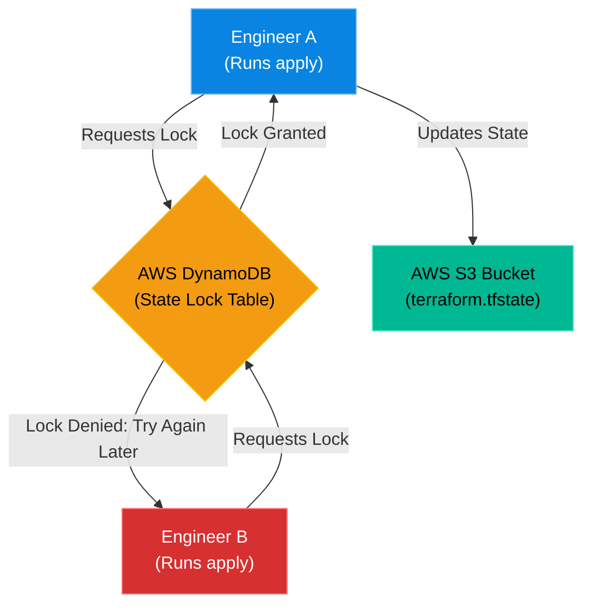

# Chapter 7 — Provisioning Cloud Resources

## Learning Objectives

The modern enterprise lives in the cloud. In this chapter, we explore advanced cloud provisioning patterns, focusing on building scalable, fault-tolerant architectures across AWS, GCP, and Azure.

By the end of this chapter, you will be able to:
* Configure Terraform to authenticate with a Cloud Provider.
* Utilize Input Variables to make Terraform code reusable.
* Understand the dangers of a local state file in a team environment.
* Configure a Remote Backend and State Locking (S3 + DynamoDB).

## Visual Architecture: Remote State Management

In Chapter 6, Terraform wrote the `terraform.tfstate` file directly to your local laptop hard drive. If you are a solo developer, this is fine. If you work on a team of 10 engineers, a local state file is a disaster. 
If Engineer A runs `terraform apply`, their laptop updates the state. Engineer B has no idea this happened because their laptop has an old, outdated state file. 
To solve this, Enterprise environments use a **Remote Backend**. The state file is stored centrally in the cloud (like an AWS S3 bucket), ensuring every engineer on the team reads from the exact same source of truth.

## Theory & Concepts

### 1. Variables and Reusability
You should never hardcode values in Terraform. If you hardcode `instance_type = "t2.micro"`, you cannot reuse that code for the Production environment (which needs `t3.large`).
By defining an `input variable`, you pass the value in at runtime:
`instance_type = var.env_instance_type`
You can then create different `.tfvars` files for different environments (e.g., `dev.tfvars`, `prod.tfvars`).

### 2. Provider Authentication
To provision an AWS EC2 instance, Terraform needs your AWS API Keys. **Never hardcode API keys into your `.tf` files!** If you commit them to GitHub, your AWS account will be compromised within 5 minutes. 
Instead, configure your local environment variables (`AWS_ACCESS_KEY_ID`), or use IAM Roles, and the Terraform provider will automatically detect and use them securely.

### 3. State Locking
What happens if Engineer A and Engineer B both run `terraform apply` on a Remote Backend at the exact same millisecond? They will both try to write to the state file simultaneously, permanently corrupting the JSON structure.
**State Locking** prevents this. Before Terraform executes an apply, it writes a "Lock" to a database (like AWS DynamoDB). If Engineer B tries to apply, Terraform checks DynamoDB, sees Engineer A's lock, and completely halts Engineer B's execution until Engineer A is finished.

## Scenario-Based Troubleshooting

### Scenario A: The State File Conflict

> [!IMPORTANT]  
> **Incident Report: The State File Conflict**  
> **Reporter:** CI/CD Pipeline  
> **SOP execution:**
> 1. **10:00 AM — Incident Receipt:** An automated Terraform deployment fails with `Error acquiring the state lock. Lock Info: ID: 4b29f... Who: admin@laptop`.
> 2. **10:02 AM — Triage & Containment:** The pipeline halts gracefully, ensuring no partial infrastructure changes occur.
> 3. **10:05 AM — Investigation:** The engineer sees the lock error. The DynamoDB lock table actively prevented the pipeline from corrupting the state file.
> 4. **10:07 AM — Root Cause:** A Lead Architect was concurrently running a manual `terraform apply` locally (`admin@laptop`), locking the remote state.
> 5. **10:10 AM — Resolution:** The engineer pings the architect to finish their apply. Once completed, the lock clears. The pipeline is restarted.
> 6. **10:15 AM — Verification:** The pipeline completes the deployment successfully. Downtime: 0 minutes (prevented).
> 7. **Post-Mortem:** Discuss why the architect ran a local apply instead of pushing code through the pipeline.
> 8. **Documentation:** Enforce a strict "No Local Apply" policy except for break-glass scenarios.

> [!IMPORTANT]  
> **Best Practice: Remote State Security**  
> The `.tfstate` file is not just a map of your infrastructure; it contains every single variable in plain text. If you use Terraform to create a Kubernetes cluster, the `kubeconfig` admin password is saved in plain text inside the `.tfstate` file! You must *always* restrict IAM access to the S3 bucket holding your state files, and enforce KMS Encryption at Rest on that bucket.

## Hands-on Lab

> [!TIP]
> **Practice Assignment Available**
> Proceed to the [Chapter 7 Practice Guide](../practice-files/V4-C07-practice.md) to conceptually configure a Remote Backend and write your first AWS EC2 deployment manifest!

## Interview Questions

### Question 1: What is the purpose of a Remote Backend in Terraform, and why is it necessary for teams?
* **Target Answer**: "A Remote Backend stores the `terraform.tfstate` file centrally in the cloud (like an AWS S3 bucket) rather than on a local laptop. This is mandatory for teams because it ensures every engineer is executing Terraform plans against the exact same, up-to-date source of truth, rather than working from isolated, outdated local state files."

### Question 2: Explain the concept of State Locking and how it prevents corruption.
* **Target Answer**: "State Locking is a safety mechanism used alongside a Remote Backend. When an engineer executes a `terraform apply`, Terraform writes a lock entry to a central database (like DynamoDB). If a second engineer attempts an `apply` concurrently, Terraform checks the database, sees the active lock, and rejects the second execution. This prevents simultaneous write-operations that would irreparably corrupt the JSON state file."

### Question 3: How do you pass secrets, such as a Database Password, into Terraform without hardcoding them in the `.tf` file?
* **Target Answer**: "You should declare a variable for the password (e.g., `variable "db_password" { sensitive = true }`), but you never assign the value in the code. Instead, you pass the value at runtime via the CLI using `-var="db_password=value"`, or you set an environment variable named `TF_VAR_db_password` which Terraform will automatically detect. Furthermore, setting `sensitive = true` ensures Terraform redacts the value from the console output."

## Common Mistakes & Pro-Tips

> [!WARNING] Common Mistake
> Hardcoding cloud credentials directly into Terraform `provider` blocks. If you commit an AWS Access Key to GitHub inside a `.tf` file, bots will scrape it and spin up thousands of dollars of crypto-miners in minutes. Always use IAM roles or environment variables.

> [!TIP] Pro-Tip
> Use `terraform fmt` before committing code to automatically format it to the Hashicorp standard, and use `terraform validate` in your CI/CD pipeline to catch syntax errors before generating a plan.

## Chapter Summary

Terraform is incredibly powerful, but with great power comes the ability to completely destroy a company's infrastructure in a few seconds. By mastering Remote Backends, State Locking, and Variables, you ensure your infrastructure code is scalable, safe, and ready for enterprise collaboration.

## Completion Checklist

- [ ] I understand the necessity of a Remote Backend (S3).
- [ ] I can explain how DynamoDB provides State Locking.
- [ ] I know why API keys should never be committed to `.tf` files.

---

## Navigation

⬅ Previous:
[Chapter 6 – Introduction to IaC & Terraform](V4-C06-iac-terraform.md)

🏠 Volume Contents:
[Table of Contents](../TOC.md)

➡ Next:
[Chapter 8 – Configuration Management at Scale](V4-C08-ansible-intro.md)
