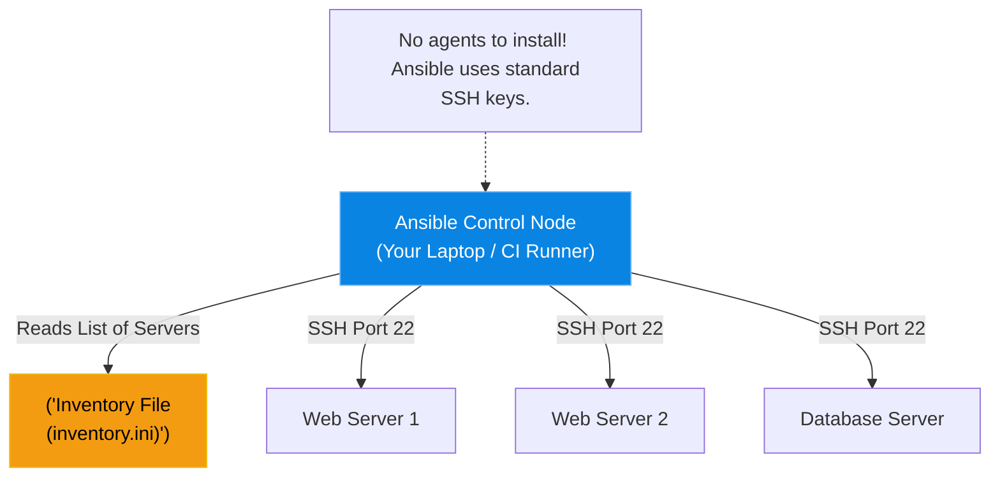

# Chapter 8 — Configuration Management at Scale

## Learning Objectives

Managing configuration drift across thousands of servers requires powerful automation. In this chapter, we introduce Ansible, an agentless configuration management tool that turns manual toil into instant enforcement.

By the end of this chapter, you will be able to:
* Differentiate between Infrastructure Provisioning (Terraform) and Configuration Management (Ansible).
* Explain Ansible's "Agentless" architecture.
* Define an Ansible Inventory file.
* Execute Ansible Ad-Hoc commands across multiple servers simultaneously.

## Visual Architecture: The Agentless Automator

If Terraform's job is to ask AWS for 50 blank Ubuntu servers, **Ansible's** job is to log into those 50 servers and install NGINX on them. 
Other configuration management tools (like Puppet or Chef) require you to install a heavy "Agent" daemon on every single server you want to manage. Ansible is **Agentless**. It only requires Python and SSH. The central Ansible controller simply SSHs into the remote servers, executes Python scripts, and logs out. 



## Theory & Concepts

### 1. The Inventory (`inventory.ini`)
Before Ansible can do anything, it needs to know *who* it is managing. You create an Inventory file grouping your IP addresses together.

```ini
[webservers]
192.168.1.10
192.168.1.11

[databases]
192.168.1.50

```

### 2. Ad-Hoc Commands
Sometimes you don't need a massive script; you just need to do one thing very quickly on 50 servers. You can use the `ansible` CLI to run Ad-Hoc commands. 
For example, to check the uptime of every web server in your inventory:
`ansible webservers -a "uptime" -u root`

### 3. Ansible Modules
Ansible doesn't just run raw bash commands. It uses **Modules**. Modules are pre-written Python scripts that abstract away the underlying OS. 
If you want to install Apache, you don't write `apt install apache2` (which would fail on RHEL). You use the `package` module: 
`ansible webservers -m package -a "name=apache2 state=present"`

## Scenario-Based Troubleshooting

### Scenario A: The Mass Password Rotation

> [!IMPORTANT]  
> **Incident Report: The Mass Password Rotation**  
> **Reporter:** Chief Information Security Officer (CISO)  
> **SOP execution:**
>
>
> 1. **16:00 PM — Incident Receipt:** A disgruntled system administrator was just terminated. The CISO demands the `root` password on all 500 company Linux servers be rotated immediately.
>
> 2. **16:02 PM — Triage & Containment:** Doing this manually via SSH (`passwd`) would take 16 hours, leaving a massive window of vulnerability.
>
> 3. **16:05 PM — Investigation:** The Senior Engineer confirms the dynamic `inventory.ini` has the latest IPs for all 500 servers.
>
> 4. **16:08 PM — Root Cause:** A compromised human threat vector requires an immediate, fleet-wide state change.
>
> 5. **16:10 PM — Resolution:** The engineer generates a secure hashed password. They run a single ad-hoc Ansible command: `ansible all -m user -a "name=root password='$6$HASHED_PASSWORD'" --become`.
>
> 6. **16:11 PM — Verification:** Ansible initiates 500 concurrent SSH connections and rotates all passwords. The entire fleet is secured in 12 seconds.
>
> 7. **Post-Mortem:** Discuss migrating away from shared `root` passwords entirely in favor of strict SSH Key + IAM-backed sudo authentication.
>
> 8. **Documentation:** Update offboarding procedures to trigger an automated Ansible password-rotation playbook.

> [!CAUTION]  
> **Best Practice: Never Use Passwords for SSH**  
> Because Ansible relies on SSH, it is theoretically possible to hardcode an SSH password into your `inventory.ini` file (`ansible_ssh_pass=secret`). **Never do this.** You must use SSH Key Pairs (Public/Private keys). Drop your public key onto the target servers, and use `ssh-agent` on your Ansible control node to authenticate seamlessly and securely.

## Hands-on Lab

> [!TIP]
> **Practice Assignment Available**
> Proceed to the [Chapter 8 Practice Guide](../practice-files/V4-C08-practice.md) to install Ansible and run your first ad-hoc ping command!

## Interview Questions

### Question 1: What is the primary difference between Terraform and Ansible?
* **Target Answer**: "Terraform is an Infrastructure Provisioning tool designed to manage cloud APIs and create the underlying hardware (VPCs, EC2 instances, S3 buckets). Ansible is a Configuration Management tool designed to connect to the operating systems running *on* that hardware to install software, manage users, and deploy application code."

### Question 2: Explain Ansible's "Agentless" architecture and why it is a major advantage.
* **Target Answer**: "Tools like Puppet or Chef require a dedicated 'Agent' software daemon to be installed and running constantly on every managed server. Ansible is Agentless; it only requires Python and a standard SSH connection. This is a massive advantage because there is no agent software to upgrade, no agent CPU/RAM overhead on the target servers, and you can manage a brand new server instantly as long as you have SSH access."

### Question 3: Explain the difference between executing a shell script via SSH, and executing an Ansible Module.
* **Target Answer**: "A shell script executes raw commands blindly. It does not know the state of the system before or after it runs. An Ansible Module is written in Python and is idempotent. Before an Ansible Module executes, it checks the current state of the system. If the system already matches the desired state, the Module does absolutely nothing, returning an 'OK' status and saving execution time."

## Common Mistakes & Pro-Tips

> [!WARNING] Common Mistake
> Running `ansible all -m command -a "rm -rf /tmp/cache"` without `--check`. Ad-hoc commands using the `command` or `shell` modules are NOT idempotent! Running them twice could crash a system. Always use dedicated modules (like the `file` module with `state=absent`) instead of raw shell commands whenever possible.

> [!TIP] Pro-Tip
> Use the `-f` (forks) parameter to speed up ad-hoc commands on massive fleets. By default, Ansible uses 5 concurrent forks. If you are managing 500 servers, `ansible all -m ping -f 50` will execute 50 SSH connections at a time, drastically reducing the total execution duration.

## Chapter Summary

If you find yourself SSH'ing into more than two servers a day to perform the exact same task, you are doing it wrong. Ansible allows you to treat a fleet of 1,000 servers identically to how you treat 1 server.

## Completion Checklist

- [ ] I understand the difference between Terraform and Ansible.
- [ ] I can explain the benefits of an Agentless architecture.
- [ ] I know how to use an Inventory file and run Ad-Hoc commands.


**Chapter Transition**
> We know the basics of Ansible, but running ad-hoc commands doesn't scale. We must structure our automation into Playbooks.

---

## Navigation

⬅ Previous:
[Chapter 7 — Provisioning Cloud Resources](V4-C07-cloud-provisioning.md)

🏠 Volume Contents:
[Table of Contents](../TOC.md)

➡ Next:
[Chapter 9 — Writing Ansible Playbooks & Roles](V4-C09-ansible-playbooks.md)