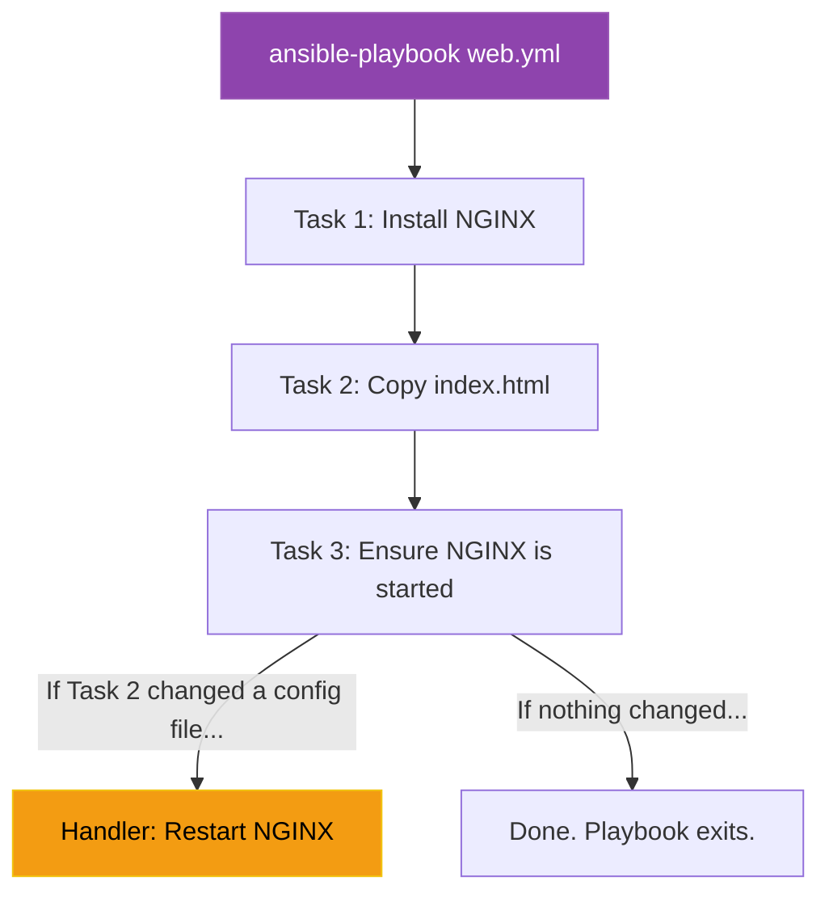

# Chapter 9 — Writing Ansible Playbooks & Roles

## Learning Objectives

Automation is only as good as the playbooks you write. In this chapter, we explore advanced Ansible Playbook design, focusing on idempotency, roles, and modular infrastructure management.

By the end of this chapter, you will be able to:
* Define Idempotency.
* Write a multi-task Ansible Playbook using YAML.
* Trigger service restarts conditionally using Handlers.
* Understand how Ansible Roles promote code reuse.

## Visual Architecture: The Playbook

Ad-Hoc commands are great for quick fixes (like changing a password). But if you want to deploy a complex NGINX web server, install SSL certificates, and configure log rotation, you cannot type 15 Ad-Hoc commands. 
Instead, you write an **Ansible Playbook**. A Playbook is a YAML file containing a list of `Tasks`. You simply run `ansible-playbook setup-web.yml`, and Ansible executes the tasks sequentially from top to bottom.

## Theory & Concepts

### 1. Idempotency (The Golden Rule)
A bash script is usually *not* idempotent. If a bash script says `echo "text" >> file.txt`, and you run the script 5 times, you will get 5 lines of text. This breaks the server.
**Idempotency** means you can run an Ansible Playbook 100 times, and the result is exactly the same as running it 1 time. Ansible Modules check the current state of the server *before* making a change. If the server already matches the Playbook, Ansible reports `ok` and skips the task entirely.

### 2. Handlers
If you copy a new `nginx.conf` file to a server, you must restart the NGINX service for the changes to take effect. But if you run the Playbook tomorrow (and the config hasn't changed), you *don't* want to restart NGINX and cause a blip in traffic!
**Handlers** solve this. A Handler is a special task that only runs at the very end of the Playbook, and *only* if another task specifically triggered it via a `notify` statement. 

### 3. Roles
As your infrastructure grows, your Playbook will become 2,000 lines long and impossible to read. **Roles** allow you to break your Playbook into modular, reusable folders. You can create a `mysql` role and a `nginx` role. If a new project requires a database, you just include the `mysql` role in the new Playbook instead of rewriting the tasks!

## Scenario-Based Troubleshooting

### Scenario A: The Configuration Drift

> [!IMPORTANT]  
> **Incident Report: The Configuration Drift**  
> **Reporter:** Automated Monitoring  
> **SOP execution:**
>
>
> 1. **02:00 AM — Incident Receipt:** PagerDuty fires for "High SSL Handshake Failures" on Load Balancer #3, and "OOM Killer invoked" on Load Balancer #7.
>
> 2. **02:05 AM — Triage & Containment:** The engineer pulls LB3 and LB7 out of the active traffic pool to stabilize the platform.
>
> 3. **02:10 AM — Investigation:** The 10 load balancers are supposed to be identical. The engineer discovers a junior admin manually installed a rogue monitoring agent on LB7 causing the memory leak, and LB3 has a legacy SSL cipher suite configuration.
>
> 4. **02:15 AM — Root Cause:** Severe Configuration Drift caused by years of manual SSH interventions by different admins.
>
> 5. **02:20 AM — Resolution:** The engineer writes a definitive `nginx-baseline.yml` Ansible Playbook dictating the exact, correct state (packages, config, certificates). They run `ansible-playbook nginx-baseline.yml -i inventory.ini`.
>
> 6. **02:22 AM — Verification:** Because Ansible is Idempotent, it ignores the healthy servers, overwrites the SSL config on LB3 (triggering an NGINX restart handler), and uninstalls the rogue agent on LB7. Traffic is routed back. Downtime: 22 minutes for degraded capacity.
>
> 7. **Post-Mortem:** Implement a policy where all server configuration changes must be made via Ansible PRs.
>
> 8. **Documentation:** Schedule the `nginx-baseline.yml` Playbook to run via Cron every night to automatically remediate any future drift.

> [!IMPORTANT]  
> **Best Practice: Cattle, Not Pets**  
> If an administrator manually edits a config file on a production server (treating it like a Pet), the nightly Ansible Playbook will overwrite their changes (treating it like Cattle). Administrators must be trained to *never* SSH into servers to make changes. If a config change is required, they must edit the Ansible Playbook in Git and let the CI/CD pipeline deploy it to all servers simultaneously.

## Hands-on Lab

> [!TIP]
> **Practice Assignment Available**
> Proceed to the [Chapter 9 Practice Guide](../practice-files/V4-C09-practice.md) to write an Idempotent Playbook with a conditional Handler!

## Interview Questions

### Question 1: What is 'Idempotency' in the context of Configuration Management?
* **Target Answer**: "Idempotency is the property where an operation can be applied multiple times without changing the result beyond the initial application. In Ansible, this means if you run a Playbook 10 times, the server's end state is exactly the same as if you ran it once. Ansible achieves this by checking the current state of the server and only applying changes if the server deviates from the desired state."

### Question 2: How do Handlers differ from standard Tasks in an Ansible Playbook?
* **Target Answer**: "Standard Tasks are executed sequentially from top to bottom every time the Playbook runs. Handlers are special tasks that only execute at the very end of the Playbook, and they *only* execute if they were explicitly triggered (notified) by a standard Task that reported a 'changed' state. This is critical for preventing unnecessary service restarts when configuration files haven't actually been modified."

### Question 3: Explain the concept of 'Configuration Drift' and how Ansible solves it.
* **Target Answer**: "Configuration Drift occurs when servers in a cluster gradually become misaligned over time due to manual, undocumented changes made by administrators directly on the servers. Ansible solves this by acting as the declarative Source of Truth. By running an idempotent Playbook periodically (e.g., nightly), Ansible detects any manual deviations on the servers and forcefully reverts them back to the standardized baseline."

## Common Mistakes & Pro-Tips

> [!WARNING] Common Mistake
> Putting `service restart` in the `tasks` section instead of using `handlers`. If you put it in the main tasks, Ansible will forcefully restart the service every single time the playbook runs, causing unnecessary micro-outages. Handlers ensure the service is only restarted if a configuration file *actually changed*.

> [!TIP] Pro-Tip
> Use the `--syntax-check` flag before running a large playbook. YAML relies on strict indentation, and a single misplaced space can crash a playbook 20 minutes into its execution. Always validate syntax first!

## Chapter Summary

Playbooks are the heart of Ansible. They allow you to define the perfect server setup once, and then apply that perfection to 1 server or 10,000 servers. By embracing idempotency and roles, you ensure your infrastructure is always predictable, scalable, and self-documenting.

## Completion Checklist

- [ ] I can define Idempotency.
- [ ] I understand how to use `notify` to trigger a Handler.
- [ ] I understand the danger of Configuration Drift.

**Chapter Transition**
> Our infrastructure and configurations are automated, but engineers shouldn't run these from their laptops. We need Continuous Integration and Delivery.

---

## Navigation

⬅ Previous:
[Chapter 8 — Configuration Management at Scale](V4-C08-ansible-intro.md)

🏠 Volume Contents:
[Table of Contents](../TOC.md)

➡ Next:
[Chapter 10 — CI/CD Pipelines](V4-C10-cicd-pipelines.md)