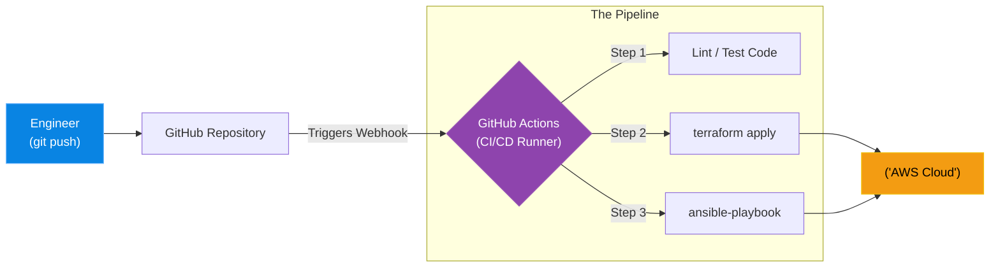

# Chapter 10 — CI/CD Pipelines

## Learning Objectives

Code deployment should be boring and predictable. In this chapter, we build CI/CD pipelines, demonstrating how to automate testing and deployment to eliminate human error from releases.

By the end of this chapter, you will be able to:
* Define Continuous Integration (CI) and Continuous Deployment (CD).
* Explain the danger of executing Terraform or Ansible from a local laptop.
* Understand the concept of CI/CD Runners.
* Trace the lifecycle of a code change from `git push` to production deployment.

## Visual Architecture: The Automated Factory

In Chapter 7, we ran `terraform apply` from our laptop. In Chapter 9, we ran `ansible-playbook` from our laptop. While great for learning, executing production deployments from a personal laptop is an enterprise anti-pattern. Laptops get lost, internet connections drop mid-deployment, and colleagues cannot see what you are executing.
**CI/CD (Continuous Integration / Continuous Deployment)** moves the execution to the Cloud. You simply push your code to Git. A CI/CD Platform (like GitLab CI or GitHub Actions) detects the push, spins up an isolated "Runner" container, and executes the Terraform or Ansible commands on your behalf.

## Theory & Concepts

### 1. Continuous Integration (CI)
CI focuses on the code *before* it is deployed. When a developer pushes Python code or Terraform HCL to a repository, the CI pipeline runs immediately. It executes automated unit tests, checks for syntax errors (linting), and scans for security vulnerabilities. If a test fails, the pipeline halts, and the code is rejected. This ensures the main branch is always in a pristine, working state.

### 2. Continuous Deployment (CD)
If the CI tests pass, the CD pipeline takes over. It compiles the code (or builds the Docker image) and automatically deploys it to the Staging environment. After an automated approval step, it runs the final deployment to Production. 

### 3. CI/CD Runners
A Runner is an ephemeral worker machine (usually a Docker container) managed by the CI/CD platform. The platform securely injects the AWS API keys and SSH keys into the Runner as environment variables. The Runner executes the pipeline, deploys the code, and then instantly destroys itself. This means your AWS keys never leave the secure boundary of the CI platform.

## Scenario-Based Troubleshooting

### Scenario A: The Laptop Bottleneck

> [!IMPORTANT]  
> **Incident Report: The Laptop Bottleneck**  
> **Reporter:** Product Marketing Team  
> **SOP execution:**
>
>
> 1. **09:00 AM — Incident Receipt:** Marketing demands an urgent, zero-day copy change to the production website.
>
> 2. **09:05 AM — Triage & Containment:** Junior engineers attempt to run the Ansible playbook, but it fails because the production SSH keys only exist on the Lead Engineer's physical laptop, and the Lead is on vacation in a cabin with no internet.
>
> 3. **09:15 AM — Investigation:** The team realizes that local execution has created a massive Single Point of Failure (the Lead's laptop). All deployments are hard-blocked.
>
> 4. **09:20 AM — Root Cause:** Infrastructure execution is tied to local machines instead of a centralized, automated pipeline.
>
> 5. **09:30 AM — Resolution:** A break-glass procedure is used to retrieve the SSH keys from the enterprise password vault. A Senior Engineer executes the deployment. 
>
> 6. **09:45 AM — Verification:** The website updates successfully. Downtime: 0 (but 45 minutes of blocked deployment).
>
> 7. **Post-Mortem:** The team mandates that all deployments must be triggered via GitHub Actions. SSH keys are migrated to GitHub Secrets.
>
> 8. **Documentation:** Write a `.github/workflows/deploy.yml` pipeline. From now on, anyone with PR approval can merge to `main`, and the pipeline handles the execution automatically.

> [!CAUTION]  
> **Best Practice: Protect the Main Branch**  
> If an automated CD pipeline is configured to deploy to production every time code is pushed to the `main` branch, you must enforce Branch Protections. No human should ever be allowed to `git push` directly to `main`. All changes must go through a Pull Request and require at least one code review approval before the pipeline is allowed to execute the deployment.

## Hands-on Lab

> [!TIP]
> **Practice Assignment Available**
> Proceed to the [Chapter 10 Practice Guide](../practice-files/V4-C10-practice.md) to conceptually design a GitLab CI/CD pipeline file!

## Interview Questions

### Question 1: Why is executing Terraform or Ansible directly from an engineer's laptop considered an enterprise anti-pattern?
* **Target Answer**: "Local execution introduces several critical risks: First, it requires sensitive API and SSH keys to be stored on physical hardware that can be stolen or compromised. Second, it creates a 'Laptop Bottleneck' where deployments rely on a specific engineer being online. Third, there is no centralized audit trail of the execution logs. CI/CD pipelines solve this by moving execution to secure, centralized, and fully auditable cloud runners."

### Question 2: Explain the difference between Continuous Integration (CI) and Continuous Deployment (CD).
* **Target Answer**: "Continuous Integration (CI) is the automated process of testing, linting, and validating code every time it is pushed to a repository, ensuring bad code is caught before it is merged. Continuous Deployment (CD) is the subsequent automated process of taking that validated code, building the necessary artifacts (like Docker images), and deploying it out to the staging or production infrastructure."

### Question 3: What is the purpose of a "Pre-Flight Check" in a CI pipeline?
* **Target Answer**: "A pre-flight check executes tests *before* any infrastructure is actually touched. For example, running `terraform plan` to see what *would* change, or running `ansible-playbook --syntax-check` to catch YAML errors. By putting these checks in the CI phase, you prevent malformed code from ever reaching the CD deployment phase."

## Common Mistakes & Pro-Tips

> [!WARNING] Common Mistake
> Giving a CI/CD pipeline permanent, highly privileged admin credentials. If an attacker compromises your pipeline runner, they own your entire AWS account. Use OIDC (OpenID Connect) to grant temporary, time-bound tokens to your runners instead of storing static `AWS_ACCESS_KEY_ID` secrets.

> [!TIP] Pro-Tip
> Use Branch Protection Rules in GitHub/GitLab. Configure the repository so that no human can push directly to the `main` branch. Require at least one peer approval on a Pull Request, and require that all CI tests pass before the 'Merge' button unlocks.

## Chapter Summary

CI/CD is the glue that binds modern DevOps together. By combining the declarative power of Terraform and Ansible with the automation of pipelines, you can build an environment where thousands of servers can be provisioned, configured, and updated simply by clicking "Merge" in a web browser.

## Completion Checklist

- [ ] I can define CI and CD.
- [ ] I understand why local execution causes bottlenecks.
- [ ] I know how secrets are securely managed in CI/CD platforms.

**Chapter Transition**
> Code flows automatically to production, but how do we route users to the geographically closest data center? Global DNS.

---

## Navigation

⬅ Previous:
[Chapter 9 — Writing Ansible Playbooks & Roles](V4-C09-ansible-playbooks.md)

🏠 Volume Contents:
[Table of Contents](../TOC.md)

➡ Next:
[Chapter 11 — Enterprise DNS & Global Traffic Management](V4-C11-global-dns.md)