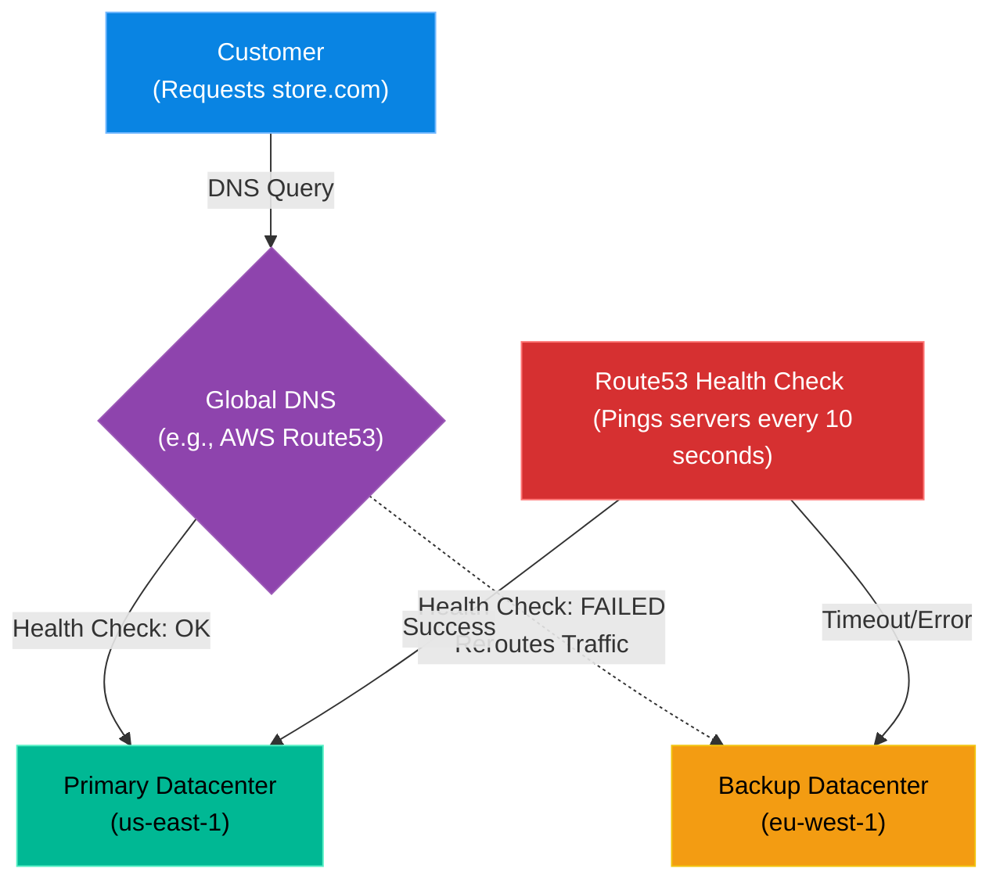

# Chapter 11 — Enterprise DNS & Global Traffic Management

## Learning Objectives

Routing traffic seamlessly across the globe is a critical enterprise challenge. In this chapter, we explore Global DNS and Anycast, ensuring users always hit the fastest, most reliable datacenter.

By the end of this chapter, you will be able to:
* Differentiate between standard DNS (Bind9) and Enterprise Anycast DNS (Route53/Cloudflare).
* Understand how DNS Health Checks enable active-passive failover.
* Explain Latency-Based and Geolocation-Based routing.
* Troubleshoot global traffic routing failures.

## Visual Architecture: Surviving the Unsurvivable

In Volume 2, you learned how to configure a local `bind9` DNS server. This is fine for an office building. However, if you are running a global e-commerce platform, a single DNS server—or even a single datacenter—is a massive Single Point of Failure.
If a hurricane destroys your primary datacenter in Virginia, you cannot wait for an engineer to wake up, log into the DNS server, and manually change the A-Records to point to the backup datacenter in Ireland. It takes too long.
**Enterprise Global DNS** (like AWS Route53 or Cloudflare) automates this survival mechanism.

## Theory & Concepts

### 1. Anycast Routing
Standard DNS relies on Unicast: one IP address maps to one specific server somewhere in the world. If a customer in Japan queries a Unicast DNS server in New York, the request is slow. 
**Anycast** allows a global network of DNS servers to share the *exact same IP address*. When a customer in Japan queries Route53, the internet backbone routes their request to the physically closest Route53 server (e.g., in Tokyo). This results in lightning-fast DNS resolution globally.

### 2. DNS Health Checks & Failover
Enterprise DNS doesn't just statically return IP addresses. It actively tests them! Route53 will ping your primary web server every 10 seconds. If the web server returns a `500 Internal Server Error` or times out three times in a row, Route53 instantly marks the A-Record as "Unhealthy". It will stop returning the primary IP and automatically start returning the IP of your Backup Datacenter.

### 3. Advanced Routing Policies
* **Latency Routing:** If you have datacenters in New York and Sydney, Route53 will calculate which datacenter will provide the lowest latency for the specific user making the request, and route them accordingly.
* **Geolocation Routing:** You can enforce geographical boundaries. For example, you can write a rule stating: "If the IP address originates from Europe, return the IP of the European datacenter to comply with GDPR."

## Scenario-Based Troubleshooting

### Scenario A: The Regional Outage

> [!IMPORTANT]  
> **Incident Report: The Regional Outage**  
> **Reporter:** Automated Monitoring  
> **SOP execution:**
>
>
> 1. **03:00 AM — Incident Receipt:** A massive fiber-optic cable is severed in Virginia, dropping AWS `us-east-1` offline.
>
> 2. **03:00:10 AM — Triage & Containment:** Route53 health checks attempt to reach the primary load balancers and time out.
>
> 3. **03:00:30 AM — Investigation:** Route53 registers three consecutive failures. The Health Check status flips from `HEALTHY` to `UNHEALTHY`.
>
> 4. **03:00:31 AM — Root Cause:** A hard physical infrastructure failure at the datacenter level.
>
> 5. **03:00:32 AM — Resolution:** Route53 automatically triggers the **Active-Passive Failover** policy. It instantly stops returning the dead `us-east-1` IP address and begins returning the Disaster Recovery IP for `eu-west-1` (Ireland).
>
> 6. **03:01 AM — Verification:** Global DNS propagates (thanks to a 60-second TTL). Customers are routed to Ireland. The Support Engineer is never paged because the automated failover was flawless.
>
> 7. **Post-Mortem:** Confirm DR cluster autoscaled properly to handle the sudden global traffic spike.
>
> 8. **Documentation:** Log the automated failover event for compliance and SLA tracking.

> [!CAUTION]  
> **Best Practice: Mind the TTL (Time to Live)**  
> DNS Failover is only effective if your DNS records have a very low TTL (e.g., 60 seconds). If you set your TTL to 24 hours, customer web browsers and ISPs will cache the dead IP address for an entire day, completely bypassing Route53's attempt to redirect them to the backup datacenter!

## Industry Incident Spotlight: The 2019 Google Cloud Routing Outage

> [!CAUTION] Industry Incident Spotlight: Google Cloud Outage (2019)
> **What Happened:** In June 2019, Google Cloud experienced a massive, multi-hour networking outage that severely degraded services like YouTube, Gmail, Google Cloud Storage, and external customers like Shopify and Discord.
>
> **The Mistake:** Google's network engineers were applying a routine configuration change to a small number of servers in a specific region. However, a bug in their automated network control plane mistakenly applied this configuration to the routing infrastructure across multiple geographic regions simultaneously.
> 
> **The Fallout:** The bad configuration caused the network to mistakenly believe that over half of Google's available network capacity was offline. The routing software reacted by forcing all global traffic into the remaining "healthy" capacity, causing catastrophic congestion and packet drops. The outage lasted for over four hours because Google's own internal tools were blocked by the network congestion, severely hindering their engineers' ability to roll back the change.
>
> **The Lesson:** Automation is a double-edged sword. While it allows for rapid, global changes, it also means that a single bad configuration can destroy a network globally in seconds. Furthermore, having "Out-of-Band" (OOB) management access that doesn't rely on the primary production network is essential for recovering from catastrophic routing failures.

## Hands-on Lab

> [!TIP]
> **Practice Assignment Available**
> Proceed to the [Chapter 11 Practice Guide](../practice-files/V4-C11-practice.md) to conceptually design a Route53 Active-Passive failover configuration!

## Interview Questions

### Question 1: What is the difference between Unicast and Anycast DNS?
* **Target Answer**: "In Unicast DNS, an IP address points to a single specific server in one geographic location. In Anycast DNS, the exact same IP address is advertised by dozens of servers globally. The core internet routing protocols (BGP) automatically route the user's DNS query to the physically closest server advertising that IP, massively reducing latency and increasing DDoS resilience."

### Question 2: Explain how DNS Failover works in an Active-Passive architecture.
* **Target Answer**: "In an Active-Passive architecture, all traffic normally flows to the Primary (Active) datacenter. The Enterprise DNS provider continuously monitors the Primary datacenter via Health Checks (HTTP/TCP probes). If the Primary datacenter fails to respond, the DNS provider marks it as unhealthy and automatically changes the A-record response to return the IP address of the Backup (Passive) datacenter, redirecting all user traffic."

### Question 3: Explain the difference between Latency-Based Routing and Geolocation Routing.
* **Target Answer**: "Geolocation Routing makes decisions based solely on the physical location of the user (e.g., routing all IP addresses originating from France to a datacenter in Paris). Latency-Based Routing ignores physical location and routes traffic to whichever datacenter responds the fastest in milliseconds at that exact moment. If the Paris datacenter is physically closer but experiencing heavy network congestion, Latency routing might dynamically send the French user to London instead to ensure the fastest load time."

## Common Mistakes & Pro-Tips

> [!WARNING] Common Mistake
> Setting your DNS TTL (Time To Live) to 24 hours while using Health Checks. If the primary site dies, Route53 will instantly failover the DNS record, but ISPs and customer browsers will cache the *old dead IP* for 24 hours, causing a massive outage anyway. Always use a 60-second TTL for active-passive endpoints.

> [!TIP] Pro-Tip
> When migrating a high-traffic domain to a new server, do not do a hard cutover. Use a Weighted Routing policy: send 95% of traffic to the old server and 5% to the new server. Monitor the new server's error rates. If it holds up, gradually dial the weight to 100%.

## Chapter Summary

Enterprise DNS is no longer a static phonebook; it is a dynamic, intelligent traffic cop. By utilizing health checks and advanced routing policies, DNS becomes the first and most critical layer of your disaster recovery strategy.

## Completion Checklist

- [ ] I understand the concept of Anycast routing.
- [ ] I can explain how DNS Health Checks enable failover.
- [ ] I understand why TTL dictates failover speed.

---

## Navigation

⬅ Previous:
[Chapter 10 – Chapter Title](V4-C10-cicd-pipelines.md)

🏠 Volume Contents:
[Table of Contents](../TOC.md)

➡ Next:
[Chapter 12 – Chapter Title](V4-C12-zero-trust.md)