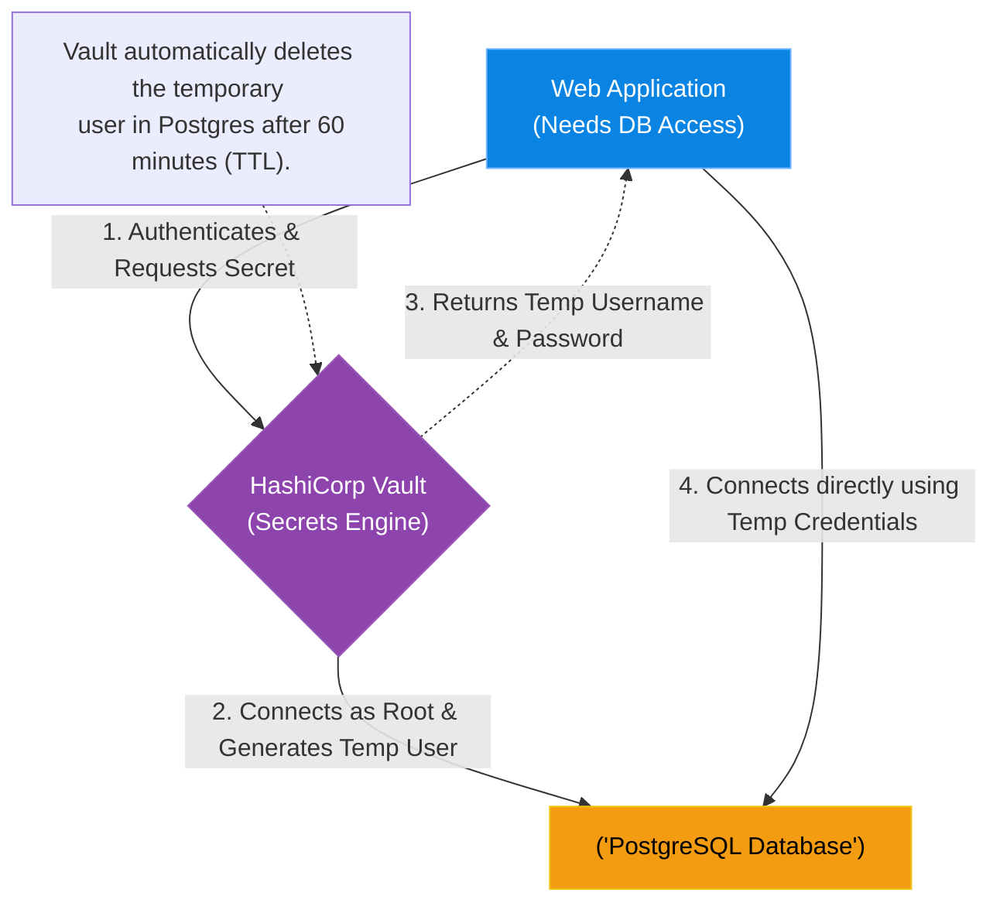

# Chapter 13 — Secrets Management & PKI

## Learning Objectives

Hardcoding passwords in code or configuration files is a security disaster waiting to happen. In this chapter, we explore robust Secrets Management using tools like HashiCorp Vault.

By the end of this chapter, you will be able to:
* Explain the risks of Static Secrets (Sprawl).
* Define the architecture of a Centralized Secrets Manager (HashiCorp Vault).
* Explain the concept of a Dynamic Secret.
* Understand the role of an Internal Certificate Authority (PKI).

## Visual Architecture: The Dynamic Secret

In traditional infrastructure, a Database Administrator creates a username (`webapp-user`) and a password (`super-secret`) inside the PostgreSQL database. They hand this password to the developers, who put it in their CI/CD pipeline and their Kubernetes Secrets. 
This is a **Static Secret**. It exists forever until a human manually changes it. Over time, these passwords suffer from "Secret Sprawl"—they end up in Slack messages, Wiki pages, and developer laptops. 

**HashiCorp Vault** solves this. Vault connects directly to PostgreSQL. The application never asks the DBA for a password; it asks Vault.

## Theory & Concepts

### 1. Centralized Secret Management
A Secrets Manager (like HashiCorp Vault, AWS Secrets Manager, or Azure Key Vault) acts as the single source of truth for all sensitive data. It heavily encrypts data at rest, provides strict Role-Based Access Control (RBAC), and logs a detailed audit trail of exactly *who* accessed *which* secret at *what* time.

### 2. Dynamic Secrets
The true power of Vault is the **Dynamic Secret**. Instead of storing a static password, Vault stores the root credentials to the database. When an application requests access, Vault generates a brand-new, unique username and password on the fly, hands it to the application, and sets a Time-to-Live (TTL) of 60 minutes. After 60 minutes, Vault automatically logs into the database and deletes the user. 
This means there are zero static passwords for hackers to steal.

### 3. Public Key Infrastructure (PKI)
Zero Trust Architecture requires that all internal traffic is encrypted (HTTPS/TLS). Buying public SSL certificates for thousands of internal servers is expensive. 
Vault can act as an Internal Certificate Authority (CA). Applications can request a dynamic TLS certificate from Vault, use it to encrypt internal traffic, and Vault will automatically revoke it after a few days, ensuring perfect internal encryption.

## Scenario-Based Troubleshooting

### Scenario A: The Leaked Database Password

> [!IMPORTANT]  
> **Incident Report: The Leaked Database Password**  
> **Reporter:** Automated Secrets Scanning (GitGuardian)  
> **SOP execution:**
> 1. **14:00 PM — Incident Receipt:** A junior developer accidentally commits their local configuration file to a public GitHub repository. It contains PostgreSQL database credentials.
> 2. **14:02 PM — Triage & Containment:** A hacker's bot scrapes GitHub and attempts to log into the public-facing DB port using the credentials.
> 3. **14:05 PM — Investigation:** In a traditional static environment, this would be a catastrophic data breach. But the database rejects the hacker's connection. 
> 4. **14:07 PM — Root Cause:** The credentials the developer committed were Dynamic Secrets generated by HashiCorp Vault.
> 5. **14:09 PM — Resolution:** The credentials had a strict 60-minute TTL. Vault had automatically logged into PostgreSQL and completely deleted the user account from the database before the hacker even found the code on GitHub.
> 6. **14:15 PM — Verification:** The database is safe. The engineer rotates the developer's Vault token as a precaution. Downtime: 0.
> 7. **Post-Mortem:** Discuss developer workflows and how the dynamic secret made it into a git commit.
> 8. **Documentation:** Add pre-commit hooks to all developer laptops to block committing strings that look like Vault tokens or secrets.

> [!IMPORTANT]  
> **Best Practice: The AppRole Authentication Method**  
> How does an application prove its identity to Vault to request a secret? It cannot use a password (that defeats the purpose!). Applications use **AppRole** or **Kubernetes Auth**. In K8s Auth, the Pod passes its cryptographically signed Kubernetes ServiceAccount Token to Vault. Vault verifies the token with the Kube-API Server, confirms the Pod is legitimate, and returns the secret.

## Hands-on Lab

> [!TIP]
> **Practice Assignment Available**
> Proceed to the [Chapter 13 Practice Guide](../practice-files/V4-C13-practice.md) to start a local HashiCorp Vault dev server and interact with the Key-Value store!

## Interview Questions

### Question 1: What is 'Secret Sprawl' and how does a centralized Secret Manager solve it?
* **Target Answer**: "Secret Sprawl is the phenomenon where static passwords and API keys inevitably end up scattered across developer laptops, CI/CD variables, Slack messages, and plain-text configuration files over time. A centralized Secret Manager solves this by acting as the single, highly-encrypted source of truth. Applications authenticate to the Secret Manager via APIs at runtime to retrieve credentials in memory, completely eliminating the need to store passwords in files or code."

### Question 2: Explain the mechanism and security benefit of a Dynamic Secret in HashiCorp Vault.
* **Target Answer**: "Unlike a static secret which exists until a human changes it, a Dynamic Secret does not exist until it is requested. When an application requests access, Vault generates a unique, on-demand set of credentials directly on the target system (like a database) with a strict Time-to-Live (TTL). When the TTL expires, Vault automatically revokes and deletes the credentials. The benefit is that even if the secret is intercepted, its window of usefulness is incredibly small, and there are no long-lived passwords to rotate or leak."

### Question 3: How does an internal PKI (Public Key Infrastructure) engine enhance Zero Trust Architecture?
* **Target Answer**: "Zero Trust mandates that all network traffic, even internal East-West traffic between internal microservices, must be encrypted. An internal PKI engine (like Vault's PKI secret engine) acts as an automated internal Certificate Authority. It can dynamically issue short-lived TLS/SSL certificates to internal applications on the fly, allowing them to establish mutual TLS (mTLS) encryption without the administrative overhead of buying and rotating public certificates."

## Common Mistakes & Pro-Tips

> [!WARNING] Common Mistake
> Trying to use HashiCorp Vault as a generic key-value database for application data. Vault is specifically tuned for cryptographic operations and secret leases. If you use it to store megabytes of standard configuration data, you will degrade its performance and corrupt the `etcd` or Consul backend.

> [!TIP] Pro-Tip
> When using Vault Agent sidecars in Kubernetes, ensure your applications are configured to automatically reload or gracefully restart when the Vault Agent renews and updates the rendered secret file on disk, otherwise the app will continue using the expired credentials in memory!

## Chapter Summary

Static passwords are a massive liability. By implementing dynamic secrets and short-lived certificates, you dramatically reduce the blast radius of a compromised application or a stolen credential.

## Completion Checklist

- [ ] I understand the danger of Secret Sprawl.
- [ ] I can explain how a Dynamic Secret with a TTL works.
- [ ] I know how applications use K8s Auth to talk to Vault without a password.

---

## Navigation

⬅ Previous:
[Chapter 12 – Zero Trust Architecture & Identity Providers](V4-C12-zero-trust.md)

🏠 Volume Contents:
[Table of Contents](../TOC.md)

➡ Next:
[Chapter 14 – Network Policies & Microsegmentation](V4-C14-microsegmentation.md)
