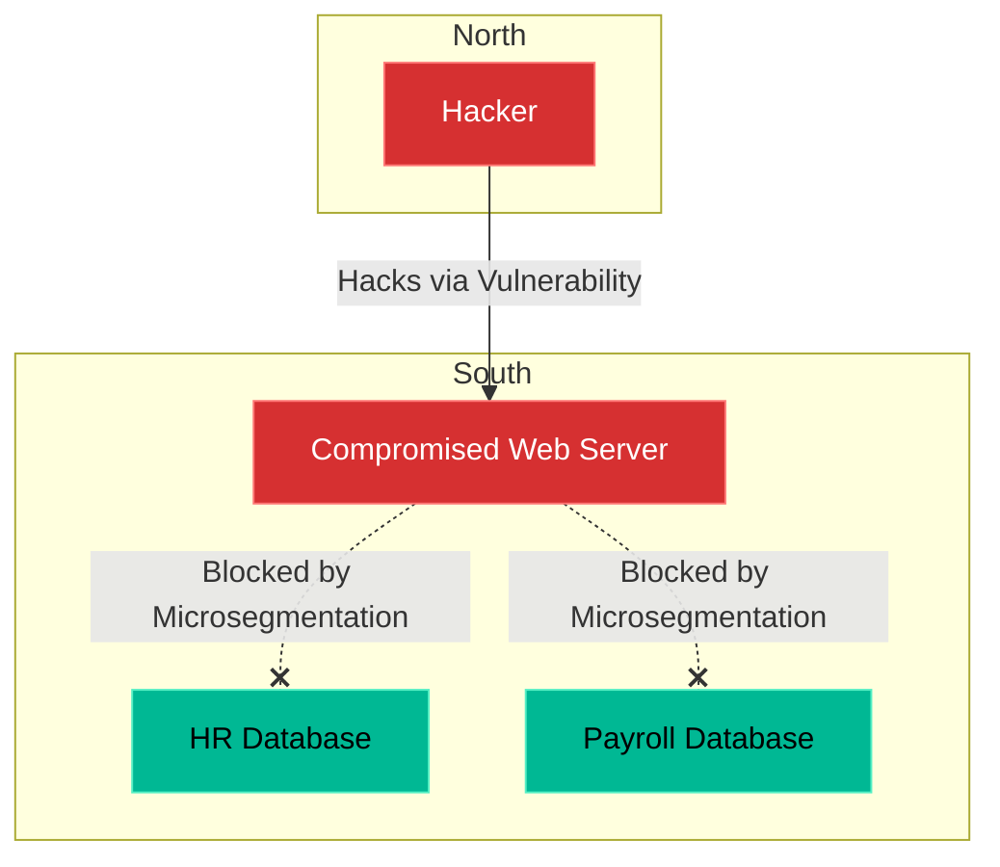

# Chapter 14 — Network Policies & Microsegmentation

## Learning Objectives

If an attacker breaches a web server, they shouldn't have unrestricted access to the database. In this chapter, we use Microsegmentation to strictly limit lateral movement within your networks.

By the end of this chapter, you will be able to:
* Define North-South vs East-West traffic.
* Explain the concept of Microsegmentation.
* Understand why a flat network is a security liability.
* Write a Kubernetes `NetworkPolicy` to isolate Pods.

## Visual Architecture: Securing East-West Traffic

In traditional networking, a giant perimeter firewall secures **North-South traffic** (traffic coming in from the internet). However, once traffic passes the firewall, the internal network is usually "flat." This means Server A can ping Server B, even if they have no business talking to each other. 
This is dangerous. If a hacker compromises Server A, they use that trusted internal connection to move laterally and compromise Server B (this is **East-West traffic**).
**Microsegmentation** solves this by putting a microscopic firewall around *every single application*, ensuring they can only communicate with explicitly approved peers.

## Theory & Concepts

### 1. The Flat Network Problem
By default, Kubernetes clusters are completely flat. Every Pod in the cluster can talk to every other Pod in the cluster, even across different Namespaces! If you have a Dev Namespace and a Prod Namespace, a compromised Dev Pod can reach out and attack the Prod database!

### 2. Kubernetes NetworkPolicies
A **NetworkPolicy** is a declarative YAML file that acts as a distributed firewall inside the cluster. It is implemented by the Container Network Interface (CNI) plugin (like Calico or Cilium).
You use Labels to define rules. For example: "The Database Pod will drop all incoming TCP traffic *unless* the traffic comes from a Pod labeled `role: backend-api`."

### 3. The Default Deny Strategy
The absolute best practice in microsegmentation is the "Default Deny" posture. You write a NetworkPolicy that blocks *all* traffic in the entire Namespace. Instantly, all your applications break. 
Then, you surgically write "Allow" policies to punch microscopic holes in the firewall, permitting only the exact traffic paths required for the application to function. 

## Scenario-Based Troubleshooting

### Scenario A: The Lateral Movement

> [!IMPORTANT]  
> **Incident Report: The Lateral Movement**  
> **Reporter:** Security Operations Center (SOC)  
> **SOP execution:**
> 1. **22:00 PM — Incident Receipt:** SOC detects anomalous `nmap` scanning originating from the `wordpress-deployment` pod inside the production Kubernetes cluster.
> 2. **22:05 PM — Triage & Containment:** The engineer cordons the node and isolates the WordPress pod, but realizes the hacker has already attempted to connect to the internal Payroll Postgres database.
> 3. **22:10 PM — Investigation:** In a flat network, the hacker would have brute-forced the DB. But the engineer previously implemented a strict default-deny `NetworkPolicy` across the cluster.
> 4. **22:15 PM — Root Cause:** An unpatched plugin on the WordPress blog allowed an RCE exploit, granting a root shell inside the container.
> 5. **22:20 PM — Resolution:** The Calico CNI intercepted the hacker's lateral traffic. Because the network policy strictly dictated `allow ingress from app: payroll-api`, traffic from the `app: wordpress` pod was silently dropped at the kernel level.
> 6. **22:25 PM — Verification:** The intrusion was entirely contained to the edge pod. The Payroll DB logs show zero connection attempts. The WordPress pod is killed and patched. Downtime: 0 for core services.
> 7. **Post-Mortem:** Accelerate the patch cycle for third-party CMS plugins.
> 8. **Documentation:** Add a SOC dashboard specifically tracking dropped packets from the default-deny policy to identify future compromised edge nodes.

> [!CAUTION]  
> **Best Practice: Verify Your CNI Plugin**  
> If you write a `NetworkPolicy.yaml` and apply it to your cluster, the API Server will happily accept it and return `created`. However, if your cluster's CNI plugin (like Flannel) does not support Network Policies, the rules will be completely ignored, and traffic will flow freely! Always ensure you are running a policy-enforcing CNI like Calico or Cilium in production.

## Hands-on Lab

> [!TIP]
> **Practice Assignment Available**
> Proceed to the [Chapter 14 Practice Guide](../practice-files/V4-C14-practice.md) to conceptually design a Kubernetes NetworkPolicy that isolates a database!

## Interview Questions

### Question 1: What is the difference between North-South and East-West network traffic?
* **Target Answer**: "North-South traffic refers to data flowing into or out of the datacenter (e.g., from a user on the public internet hitting an external load balancer). East-West traffic refers to data flowing laterally *within* the datacenter (e.g., a web server communicating with a backend database). Traditional security focused heavily on North-South firewalls, while ignoring East-West."

### Question 2: Why is a default Kubernetes network configuration considered a security risk?
* **Target Answer**: "By default, Kubernetes implements a 'flat' network architecture where all Pods can communicate with all other Pods across all Namespaces without restriction. This is a massive security risk because if a single public-facing container is compromised, the attacker can use it as a jump host to launch lateral attacks against internal databases or other sensitive applications within the cluster."

### Question 3: How does Microsegmentation limit the 'Blast Radius' of a security breach?
* **Target Answer**: "The blast radius is the total amount of damage an attacker can do after compromising a single system. In a flat network, the blast radius is the entire datacenter. With microsegmentation, if an attacker compromises a frontend web server, they are physically blocked at the network level from moving laterally to the backend databases or internal HR tools. The blast radius is restricted solely to the single compromised segment."

## Common Mistakes & Pro-Tips

> [!WARNING] Common Mistake
> Assuming AWS Security Groups or Kubernetes Network Policies provide Application-Layer (Layer 7) security. They do not. A Network Policy will allow *all* HTTP traffic on port 80 if the rule permits it, even if that HTTP traffic contains a malicious SQL injection payload. You must pair Microsegmentation (Layer 4) with a Web Application Firewall (Layer 7) for full defense-in-depth.

> [!TIP] Pro-Tip
> When implementing a default-deny policy in an existing legacy cluster, use a "Log-Only" or "Dry-Run" mode first if your CNI supports it (like Calico Enterprise). This allows you to monitor exactly what legitimate traffic you are about to break before you actually flip the switch to block mode.

## Chapter Summary

Trusting an IP address just because it is "inside" your network is a recipe for disaster. Microsegmentation ensures that even if the outer castle wall is breached, every single room inside the castle is locked by a vault door.

## Completion Checklist

- [ ] I can define North-South vs East-West traffic.
- [ ] I understand the danger of a flat network.
- [ ] I know how a NetworkPolicy uses Labels to restrict traffic.

---

## Navigation

⬅ Previous:
[Chapter 13 – Secrets Management & PKI](V4-C13-secrets-management.md)

🏠 Volume Contents:
[Table of Contents](../TOC.md)

➡ Next:
[Chapter 15 – Incident Response & Security Auditing](V4-C15-incident-response.md)
