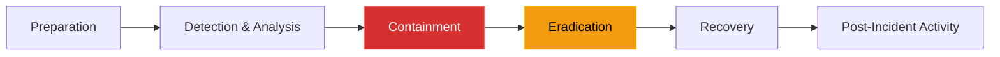

# Chapter 15 — Incident Response & Security Auditing

## Learning Objectives

When a major outage occurs, chaos is your enemy. In this chapter, we outline a structured Incident Response framework, helping you manage communication, triage, and mitigation during critical events.

By the end of this chapter, you will be able to:
* Define the phases of the Incident Response Lifecycle.
* Differentiate between Containment and Eradication.
* Understand the role of `auditd` in Linux forensics.
* Explain the purpose of a SIEM (Security Information and Event Management) system.

## Visual Architecture: The Incident Response Lifecycle

Despite the best Firewalls, Zero Trust, and Microsegmentation, you *will* eventually be hacked. A zero-day vulnerability in a core piece of software can bypass all defenses.
When this happens, the Senior Support Engineer must follow a strict lifecycle. Panic causes mistakes. 

## Theory & Concepts

### 1. Containment vs Eradication
The most common mistake junior engineers make during a breach is instantly deleting the hacked server or killing the malicious process. This is **Eradication**, and doing it too early destroys all forensic evidence!
**Containment** means stopping the bleeding *without* destroying the server. If a VM is compromised, you do not delete it. You change its AWS Security Group to block all inbound and outbound internet access, isolating it. This allows the security team to SSH in (via a secure bastion) and analyze the RAM and logs to figure out *how* the hacker got in.

### 2. Linux Auditing (`auditd`)
If a hacker steals a file, `/var/log/syslog` will likely not record it. To track exact system calls (like a process opening `/etc/shadow`), Linux uses the **Audit Daemon (`auditd`)**.
`auditd` ties deeply into the Linux kernel. It can record every time a specific user executes a command, opens a specific file, or changes a permission, providing an irrefutable trail of evidence during forensic analysis.

### 3. SIEM and Log Aggregation
If a hacker gains root access to a server, the very first thing they do is type `rm -rf /var/log/audit/` to delete the evidence of their crime.
To prevent this, enterprises use a **SIEM** (like Splunk or ELK). A small daemon on the Linux server instantly streams every single log line over the network to the centralized, highly-secure SIEM cluster. Even if the hacker deletes the local logs, the SIEM already has a permanent, read-only copy of their actions.

## Scenario-Based Troubleshooting

### Scenario A: The Crypto Miner

> [!IMPORTANT]  
> **Incident Report: The Crypto Miner**  
> **Reporter:** Datadog Anomaly Detection  
> **SOP execution:**
> 1. **16:00 PM — Incident Receipt:** An alert fires for `CPU Usage > 99% for 15 minutes` on a legacy internal file server.
> 2. **16:05 PM — Triage & Containment:** The engineer logs in, runs `top`, and sees a process disguised as `kthreadd` consuming 100% CPU. Instead of killing the process (which destroys evidence in RAM), they contain it by removing the `0.0.0.0/0` outbound security group rule, cutting the miner off from its pool.
> 3. **16:10 PM — Investigation:** The engineer queries the centralized SIEM for auth logs on this server. They discover a developer's SSH key was used to log in at 15:15 PM from an unknown foreign IP.
> 4. **16:15 PM — Root Cause:** A compromised developer SSH key allowed an attacker to bypass the perimeter and install a crypto-mining payload.
> 5. **16:20 PM — Resolution:** The engineer contacts the developer and globally revokes their compromised SSH key. 
> 6. **16:25 PM — Verification:** The infected server is treated as toxic waste. It is isolated for forensics, and a clean replacement is instantly spun up via Terraform. Traffic is routed to the clean node.
> 7. **Post-Mortem:** Conduct a full review of how the developer's private key was stolen (it was uploaded to a public pastebin). 
> 8. **Documentation:** Update access policies to require hardware-backed YubiKey SSH certificates instead of static PEM files.

> [!IMPORTANT]  
> **Best Practice: Immutable Infrastructure**  
> In modern environments, Eradication and Recovery are often the same step. You do not try to "clean" a hacked server. You contain it for forensic analysis, and then you use Terraform/Kubernetes to instantly deploy a brand new, clean replacement server. The infected server is treated as toxic waste and eventually destroyed.

## Hands-on Lab

> [!TIP]
> **Practice Assignment Available**
> Proceed to the [Chapter 15 Practice Guide](../practice-files/V4-C15-practice.md) to configure `auditd` to monitor the `/etc/shadow` file for unauthorized access!

## Interview Questions

### Question 1: During a security breach, why is Containment prioritized before Eradication?
* **Target Answer**: "If an engineer immediately eradicates a threat (e.g., by deleting the infected server or killing the malicious process), they destroy all forensic evidence in RAM and local logs. This prevents the security team from analyzing the malware, determining the root cause of the breach, or discovering if the attacker moved laterally to other systems. Containment (like changing firewall rules to isolate the server) stops the attack while preserving the crime scene."

### Question 2: What is the purpose of the Linux `auditd` daemon?
* **Target Answer**: "Standard system logs (`syslog`) generally only capture high-level application events. The `auditd` daemon ties directly into the Linux kernel to monitor system calls. It provides a highly granular, irrefutable audit trail of security-relevant events, such as tracking exactly which user ID read a sensitive file, executed a specific binary, or modified system permissions."

### Question 3: A hacker gains root access to a server and immediately deletes the `/var/log` directory to cover their tracks. How does a SIEM architecture defeat this?
* **Target Answer**: "A SIEM (Security Information and Event Management) system relies on remote log aggregation. As soon as a log event (like a successful SSH login) occurs on the server, a local agent (like Promtail or Filebeat) instantly ships a copy of that log over the network to the centralized SIEM database. Even if the hacker deletes the local files on the compromised machine a minute later, the irrefutable evidence has already been securely archived off-site in the SIEM."

## Common Mistakes & Pro-Tips

> [!WARNING] Common Mistake
> Rushing straight to Eradication during an active breach. If you panic and reboot the server or delete the malware files, you destroy critical forensic evidence (like active network connections in RAM or temporary payload files). Always isolate and contain the machine at the network level first, preserving the crime scene for the SOC team.

> [!TIP] Pro-Tip
> When isolating a compromised virtual machine, don't just change the firewall rules. Take a snapshot of the VM's hard drive and a dump of its RAM *before* you turn it off. Security analysts use these memory dumps to extract encryption keys and uncover advanced fileless malware.

## Chapter Summary

Incident Response is a high-stress test of your engineering discipline. By strictly following the lifecycle, prioritizing containment over hasty eradication, and relying on centralized SIEM logs, you can systematically dismantle an attack and prevent it from ever happening again.

## Completion Checklist

- [ ] I understand the difference between Containment and Eradication.
- [ ] I know how `auditd` tracks kernel-level system calls.
- [ ] I understand why local logs cannot be trusted after a root compromise.

---

## Navigation

⬅ Previous:
[Chapter 14 – Network Policies & Microsegmentation](V4-C14-microsegmentation.md)

🏠 Volume Contents:
[Table of Contents](../TOC.md)

➡ Next:
[Volume 4, Part 4: The Art of Troubleshooting (Senior Diagnostics) *[Planned]*](#)
