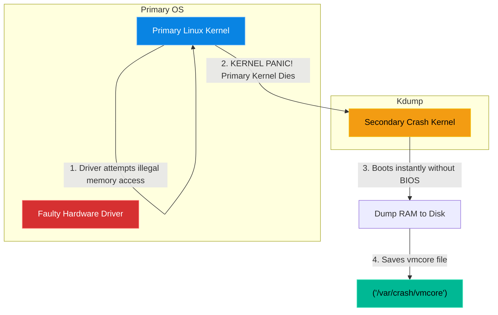

# Chapter 17 — Kernel Panics & Crash Analysis

## Learning Objectives

When the Linux kernel itself crashes, you lose your normal debugging tools. In this chapter, we explore Kdump and crash analysis, showing you how to read the tea leaves left behind by a Kernel Panic.

By the end of this chapter, you will be able to:
* Define a Kernel Oops vs a Kernel Panic.
* Understand the architecture of `kexec` and `kdump`.
* Explain why standard `syslog` cannot capture panic events.
* Use the `crash` utility to analyze a memory core dump.

## Visual Architecture: The Second Kernel

When a normal application (like NGINX) crashes, the Linux Kernel kills it, writes an error to `/var/log/syslog`, and keeps the server running. 
But what happens when the Linux Kernel *itself* crashes (a **Kernel Panic**)? The kernel is dead. It cannot write to the hard drive. It cannot send a network packet. The server instantly freezes.
To capture evidence of this death, Linux uses **kdump**. At boot time, Linux reserves a tiny chunk of RAM and loads a completely separate, secondary "Crash Kernel" into it. When the primary kernel panics, the CPU instantly switches to the Crash Kernel.

## Theory & Concepts

### 1. Oops vs Panic
* **Kernel Oops:** The kernel detected an internal bug (e.g., a bad pointer in a driver) but it was not fatal to the entire system. It kills the offending process, prints a warning to `dmesg`, and keeps running.
* **Kernel Panic:** A fatal error. The kernel determines that continuing to run would result in severe data corruption. To protect your hard drives, it intentionally commits suicide and halts the CPU. 

### 2. The `vmcore` File
When `kdump` takes over, its sole purpose is to take a snapshot of exactly what was in the server's RAM at the millisecond of the crash. It compresses this data and writes it to the hard drive as a file called `vmcore` (Virtual Memory Core), usually located in `/var/crash/`.

### 3. The `crash` Utility
You cannot read a `vmcore` file with `cat`. It is a massive binary blob of raw memory registers. You must install the `crash` utility. This tool loads the `vmcore` file alongside the kernel's debug symbols (`vmlinux`), allowing you to type commands like `log` (to see the last kernel messages) or `bt` (to see the backtrace of the exact function that caused the crash).

## Scenario-Based Troubleshooting

### Scenario A: The Midnight Reboot

> [!IMPORTANT]  
> **Incident Report: The Midnight Reboot**  
> **Reporter:** Infrastructure Monitoring  
> **SOP execution:**
>
>
> 1. **08:00 AM — Incident Receipt:** An alert shows a critical database server has randomly rebooted in the middle of the night for the third time this week.
>
> 2. **08:05 AM — Triage & Containment:** The server is back online, but the engineer shifts database traffic to the read-replica to prevent application crashes if it reboots again.
>
> 3. **08:15 AM — Investigation:** The engineer checks `/var/log/syslog`. There are no errors. The logs simply stop at 2:14 AM and resume at 2:18 AM. Because the kernel died instantly, it couldn't write the error to disk.
>
> 4. **08:30 AM — Root Cause:** Unknown hardware or driver fault causing a Kernel Panic. The engineer configures `kdump` to capture the memory state on the next crash.
>
> 5. **Three Days Later — Resolution:** The server crashes again. The engineer opens the resulting `vmcore` dump using the `crash` utility. The `bt` (backtrace) reveals a proprietary RAID controller driver (`megaraid_sas`) leaking memory and triggering a panic during heavy I/O. The engineer updates the driver to a patched version.
>
> 6. **09:00 AM — Verification:** The server runs for 14 days without a reboot. Traffic is shifted back. Downtime: 4 minutes (previous reboots).
>
> 7. **Post-Mortem:** Discuss why `kdump` is not enabled by default on high-tier database images.
>
> 8. **Documentation:** Add a Terraform provisioner to ensure `kexec-tools` and `kdump` are active on all bare-metal database instances.

> [!CAUTION]  
> **Best Practice: Disk Space for Core Dumps**  
> If you have a database server with 256GB of RAM, and it panics, `kdump` will attempt to write a 256GB `vmcore` file to the hard drive! If your `/var` partition only has 50GB of free space, `kdump` will fail, and you will lose the evidence. You must configure `kdump.conf` to heavily compress the dump, or dump it directly over the network to an NFS server.

## Hands-on Lab

> [!TIP]
> **Practice Assignment Available**
> Proceed to the [Chapter 17 Practice Guide](../practice-files/V4-C17-practice.md) to force a kernel panic manually using the `sysrq` trigger!

## Common Mistakes & Pro-Tips

> [!WARNING] Common Mistake
> Analyzing a crash dump using the wrong `kernel-debuginfo` package. The debug symbols you use *must* exactly match the specific kernel version that crashed (down to the minor version number). If the server crashed on `v5.4.0-104`, using the symbols for `v5.4.0-105` will result in completely unreadable garbage in the `crash` utility.

> [!TIP] Pro-Tip
> You can manually trigger a kernel panic to test if your `kdump` configuration is actually working before an emergency happens. Run `echo c > /proc/sysrq-trigger` as root. (Warning: This will instantly crash the machine, do not do this in production!)

## Interview Questions

### Question 1: Why won't you find the cause of a Kernel Panic in `/var/log/syslog`?
* **Target Answer**: "The `syslog` daemon (`rsyslogd` or `systemd-journald`) is a user-space application that writes logs to the physical hard drive. When a Kernel Panic occurs, the kernel halts the entire operating system instantly to prevent data corruption. Because the kernel is dead, the user-space logging daemon cannot execute, and the filesystem drivers cannot write the final error message to the disk."

### Question 2: Explain how `kdump` circumvents a frozen kernel to capture memory.
* **Target Answer**: "`kdump` uses the `kexec` system call to boot a secondary, minimal 'Crash Kernel' from a pre-reserved chunk of RAM. When the primary kernel panics, the CPU bypasses the BIOS/UEFI hardware initialization and instantly jumps into the Crash Kernel. Because the Crash Kernel is perfectly healthy, it mounts the filesystem and safely dumps the contents of the frozen primary kernel's RAM to a `vmcore` file on the disk."

### Question 3: What is the `OOM Killer` and why does it exist?
* **Target Answer**: "The Out-Of-Memory (OOM) Killer is a Linux kernel mechanism designed to save the operating system from completely freezing. When the server runs out of physical RAM and Swap space, the kernel calculates an 'oom_score' for every running process (based on memory usage and priority). It then forcibly sends a `SIGKILL` to the process with the highest score to free up memory and keep the kernel alive. It is a last-resort sacrifice to prevent a full system panic."

## Chapter Summary

Kernel Panics are intimidating because they provide zero feedback in standard logs. By understanding `kdump` and configuring it *before* the disaster happens, you ensure that you will always catch the culprit red-handed in the core dump.

## Completion Checklist

- [ ] I can differentiate between a Kernel Oops and a Panic.
- [ ] I understand the architecture of the Crash Kernel.
- [ ] I know how to use `crash` and the `bt` command.

---

## Navigation

⬅ Previous:
[Chapter 16 – Chapter Title](V4-C16-scientific-troubleshooting.md)

🏠 Volume Contents:
[Table of Contents](../TOC.md)

➡ Next:
[Chapter 18 – Chapter Title](V4-C18-packet-analysis.md)