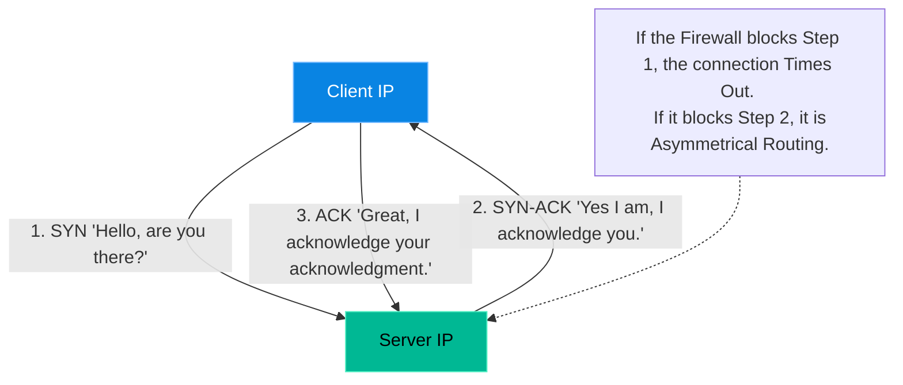

# Chapter 18 — Advanced Network Packet Analysis

## Learning Objectives

When applications blame the network, packet captures are the ultimate source of truth. In this chapter, we dive into `tcpdump` and Wireshark to diagnose latency, drops, and complex protocol failures.

By the end of this chapter, you will be able to:
* Diagram the TCP 3-Way Handshake.
* Explain what a SYN Flood is and how it causes Denial of Service.
* Use `tcpdump` to capture packets on a specific interface and port.
* Read a `.pcap` file using Wireshark for advanced visual analysis.

## Visual Architecture: The 3-Way Handshake

In Volume 2, you learned about Firewalls (`iptables`). When a firewall blocks a connection, the application usually logs "Connection Timeout." But *why* did it timeout? Did the packet never arrive, or did it arrive but the server couldn't reply?
To answer this, Senior Engineers look at the raw packets on the wire. TCP (Transmission Control Protocol) is stateful. Before any data can be transferred, it must establish a connection via the **3-Way Handshake**.

## Theory & Concepts

### 1. SYN Floods (DDoS)
A SYN Flood is a classic Denial of Service attack. The attacker sends 10,000 `SYN` packets per second to the server. The server eagerly replies with `SYN-ACK` and waits for the final `ACK`. The attacker never sends the final `ACK`. The server's memory fills up with "half-open" connections until it crashes. 

### 2. Sniffing with `tcpdump`
You cannot see packets with standard logging tools. You must use a "packet sniffer" like `tcpdump`, which binds directly to the Network Interface Card (NIC) at Layer 2 and copies every packet as it passes by.
Because a busy server handles thousands of packets a second, you must use filters. For example, to only capture TCP traffic on port 80:
`sudo tcpdump -i eth0 tcp port 80`

### 3. PCAP and Wireshark
Reading raw hex dumps in the terminal is difficult. Engineers use `tcpdump` to capture the packets into a file (called a `.pcap` file), download it to their laptop, and open it in **Wireshark**. Wireshark provides a beautiful GUI that dissects the packets, showing exactly where a connection failed.

## Scenario-Based Troubleshooting

### Scenario A: The Silent Drop

> [!IMPORTANT]  
> **Incident Report: The Silent Drop**  
> **Reporter:** Developer Team  
> **SOP execution:**
>
>
> 1. **13:00 PM — Incident Receipt:** A web application in AWS is getting a "Connection Timeout" when reaching an on-premise mainframe over a Corporate VPN.
>
> 2. **13:05 PM — Triage & Containment:** The Network Team claims the VPN firewall is completely open. The Dev Team claims their code is fine. The engineer steps in to mediate.
>
> 3. **13:10 PM — Investigation:** "Timeout" means the 3-Way Handshake is failing. The engineer runs `sudo tcpdump -i eth0 host 10.0.5.50` on the AWS server and watches the traffic.
>
> 4. **13:15 PM — Root Cause:** The `tcpdump` reveals **Asymmetrical Routing**. The AWS server sends a `SYN` through the VPN. The mainframe replies with a `SYN-ACK`, but due to an on-premise router misconfig, the `SYN-ACK` returns via the *public internet*. The AWS firewall drops the unsolicited public packet.
>
> 5. **13:20 PM — Resolution:** The engineer provides the PCAP file to the Network Team as irrefutable proof. The network team fixes the router's return-path metric.
>
> 6. **13:25 PM — Verification:** The developer triggers the connection again. A perfect `SYN, SYN-ACK, ACK` is captured. The app connects. Downtime: 3 hours of blocked development.
>
> 7. **Post-Mortem:** Discuss how subjective arguing delayed resolution, and how packet capture provided objective truth.
>
> 8. **Documentation:** Add a runbook for diagnosing asymmetrical routing across hybrid-cloud VPN tunnels.

> [!CAUTION]  
> **Best Practice: Secure your PCAP files**  
> `tcpdump` captures the *entire* packet, including the payload. If you run `tcpdump` on a web server capturing unencrypted HTTP traffic, you will capture customer passwords, session cookies, and credit card numbers in plain text. Always treat `.pcap` files as highly sensitive, confidential data, and delete them from the server immediately after analysis.

## Hands-on Lab

> [!TIP]
> **Practice Assignment Available**
> Proceed to the [Chapter 18 Practice Guide](../practice-files/V4-C18-practice.md) to run your first `tcpdump` and capture raw packets to a file!

## Interview Questions

### Question 1: Describe the TCP 3-Way Handshake.
* **Target Answer**: "To establish a reliable TCP connection, the client first sends a `SYN` (Synchronize) packet to the server. The server responds with a `SYN-ACK` (Synchronize-Acknowledge) packet, indicating it is ready. Finally, the client sends an `ACK` (Acknowledge) packet back to the server. Once this handshake is complete, data transmission can begin."

### Question 2: What is a SYN Flood attack, and how does it overwhelm a server?
* **Target Answer**: "A SYN Flood is a DDoS attack where the attacker rapidly sends thousands of `SYN` requests to a server, but deliberately never sends the final `ACK` to complete the handshake. The server allocates memory for each 'half-open' connection, waiting for the final ACK. Eventually, the server's connection queue fills up, exhausting memory and preventing legitimate users from connecting."

### Question 3: What does the `-w` flag do in `tcpdump`, and why is it useful?
* **Target Answer**: "The `-w` flag tells `tcpdump` to write the raw, binary packet data to a file (e.g., `capture.pcap`) instead of printing text to the console. This is crucial for two reasons: First, analyzing a massive capture is much easier using a graphical tool like Wireshark on your local workstation. Second, binary PCAP files retain the full payload of the packet, allowing for deep forensic analysis later."

## Common Mistakes & Pro-Tips

> [!WARNING] Common Mistake
> Running `tcpdump` on a high-traffic production load balancer without using strict filters. If you just run `tcpdump -i eth0`, you will capture millions of packets per second, instantly maxing out the CPU and filling the hard drive, bringing the entire load balancer down. Always filter by `host` and `port`!

> [!TIP] Pro-Tip
> By default, `tcpdump` attempts to resolve IP addresses to hostnames (reverse DNS lookups) before printing them to the screen. On a busy server, this can cause massive lag. Always pass the `-n` flag (e.g., `tcpdump -n -i eth0`) to disable DNS resolution and print raw IP addresses instantly.

## Chapter Summary

Logs can lie. Applications can provide misleading error messages. The Network Team might insist their firewalls are open. But packets never lie. By mastering `tcpdump`, you gain the ability to see the absolute truth of what is happening on the wire.

## Completion Checklist

- [ ] I can diagram the 3-Way Handshake.
- [ ] I understand how Asymmetrical Routing breaks connections.
- [ ] I know how to filter `tcpdump` output.

---

## Navigation

⬅ Previous:
[Chapter 17 – Chapter Title](V4-C17-kernel-panics.md)

🏠 Volume Contents:
[Table of Contents](../TOC.md)

➡ Next:
[Chapter 19 – Chapter Title](V4-C19-profiling-bottlenecks.md)