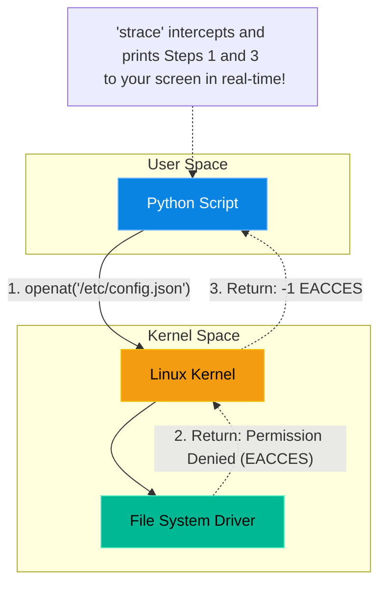

# Chapter 19 — Profiling Application Bottlenecks

## Learning Objectives

Your application is slow, but CPU and RAM look fine. What now? In this chapter, we explore advanced performance profiling using `strace`, `perf`, and flame graphs to uncover hidden bottlenecks.

By the end of this chapter, you will be able to:
* Define what a System Call (syscall) is.
* Use `strace` to attach to a running process and intercept system calls.
* Identify permission issues and infinite loops at the kernel level.
* Understand the modern transition to eBPF for performance profiling.

## Visual Architecture: The Kernel Boundary

Applications (like Python, Java, or NGINX) run in "User Space." They are not allowed to touch physical hardware directly. If a Python script wants to read a file from the hard drive, it cannot do it. It must politely ask the Linux Kernel to do it on its behalf.
This request is called a **System Call** (syscall). 
When an application is acting strangely (hanging, failing silently, or running slowly), and the application logs are completely empty, a Senior Engineer will use `strace` to watch the System Calls in real-time, effectively looking over the application's shoulder.

## Theory & Concepts

### 1. Common System Calls
To use `strace`, you must learn the language of the kernel. 
* `openat()`: The application is trying to open a file.
* `read()` / `write()`: The application is reading or writing data to a file descriptor.
* `connect()`: The application is trying to open a TCP/UDP network connection to a remote IP address.
* `futex()`: The application is waiting on a lock (Thread synchronization).

### 2. Using `strace`
You can launch an application through `strace` (e.g., `strace cat /etc/passwd`), but more often, you will "attach" `strace` to an application that is *already running* using its Process ID (PID). 
`sudo strace -p 1234`
If you want to only see file opens, you filter it: `sudo strace -e trace=openat -p 1234`.

### 3. eBPF (The Modern Profiler)
`strace` is incredibly powerful, but it has a major drawback: it pauses the application for a microsecond every time a syscall occurs, which can significantly slow down a production database.
**eBPF** (Extended Berkeley Packet Filter) is the modern replacement. eBPF allows engineers to write tiny, sandboxed programs that run directly inside the kernel, monitoring syscalls with almost zero performance overhead. Tools like `bcc` and `bpftrace` are replacing `strace` in highly sensitive production environments.

## Scenario-Based Troubleshooting

### Scenario A: The Infinite Loop

> [!IMPORTANT]  
> **Incident Report: The Infinite Loop**  
> **Reporter:** End User / Helpdesk  
> **SOP execution:**
>
>
> 1. **14:00 PM — Incident Receipt:** A custom Java application is deployed. Immediately, developers complain it is "frozen," not returning data, and the logs are empty.
>
> 2. **14:05 PM — Triage & Containment:** A junior admin attempts a reboot. The issue immediately returns. A Senior Engineer steps in to debug the live process.
>
> 3. **14:10 PM — Investigation:** `top` shows 0% CPU. The engineer attaches to the frozen process: `sudo strace -p 4055`. The screen instantly floods with: `openat(AT_FDCWD, "/etc/app/license.key", O_RDONLY) = -1 EACCES (Permission denied)`.
>
> 4. **14:15 PM — Root Cause:** The developers wrote a bad `while` loop that continuously attempts to read a license file. The file has incorrect permissions. Instead of crashing gracefully, the code loops infinitely on the `EACCES` syscall.
>
> 5. **14:20 PM — Resolution:** Without looking at Java source code, the engineer fixes the file permissions: `sudo chmod 644 /etc/app/license.key`.
>
> 6. **14:21 PM — Verification:** The next `openat()` succeeds, breaking the infinite loop. The Java app instantly unfreezes and processes data. Downtime: 21 minutes.
>
> 7. **Post-Mortem:** Send the `strace` output to the Dev team to prove their error-handling logic is fatally flawed.
>
> 8. **Documentation:** Add a step to the deployment pipeline to automatically verify `/etc/app` permissions on boot.

> [!CAUTION]  
> **Best Practice: Tracing Child Processes**  
> If you attach `strace` to the main NGINX PID (the master process), you will see almost nothing. The master process just manages workers; it doesn't serve web traffic. You must use the `-f` flag (`strace -f -p <PID>`) to tell `strace` to "follow forks" and monitor all the child worker processes that are actually doing the heavy lifting!

## Hands-on Lab

> [!TIP]
> **Practice Assignment Available**
> Proceed to the [Chapter 19 Practice Guide](../practice-files/V4-C19-practice.md) to use `strace` to watch the kernel execute a basic `cat` command!

## Interview Questions

### Question 1: What is a System Call (syscall)?
* **Target Answer**: "A System Call is the programmatic interface that a user-space application uses to request services from the operating system's kernel. Because applications are sandboxed for security, they cannot directly access hardware, memory, or the filesystem. They must execute a syscall (like `read()`, `write()`, or `connect()`), and the kernel performs the privileged action on their behalf."

### Question 2: Why would you use `strace` to troubleshoot a hanging application instead of looking at the application's logs?
* **Target Answer**: "Application logs are only useful if the developer explicitly wrote code to catch an error and log it. If an application hangs due to a deadlock (`futex`), an infinite loop, or a blocked network connection, it is often incapable of writing to its log file. `strace` bypasses the application entirely, allowing the engineer to watch the raw interactions between the process and the Linux kernel in real-time to definitively prove what the application is waiting for."

### Question 3: What does the `lsof` command do, and why is it useful when an application claims a "Port is already in use"?
* **Target Answer**: "`lsof` stands for 'List Open Files'. In Linux, everything is a file, including network sockets. If an application fails to start because port 8080 is in use, running `sudo lsof -i :8080` will reveal the exact Process ID (PID) and the name of the rogue application currently bound to that network port, allowing the engineer to kill it and free the port."

## Common Mistakes & Pro-Tips

> [!WARNING] Common Mistake
> Running `strace` on a high-throughput database server in production. `strace` introduces massive overhead (sometimes slowing down the traced process by 50x) because it intercepts every single system call. If you attach `strace` to a busy Postgres master, you could cause an immediate, catastrophic performance outage.

> [!TIP] Pro-Tip
> When using `strace`, use the `-c` (count) flag for a high-level summary instead of a blinding wall of text. E.g., `strace -c -p <PID>`. It will monitor the process for a few seconds, and when you press `Ctrl+C`, it prints a neat table showing which system calls took the most time.

## Chapter Summary

When an application lies to you, or simply stops speaking, `strace` allows you to interrogate the kernel instead. By understanding the common system calls, you can debug any binary executable on earth, even if you do not possess the source code.

## Completion Checklist

- [ ] I understand the boundary between User Space and Kernel Space.
- [ ] I can explain what a System Call is.
- [ ] I know how to use `strace` to attach to a running PID.

**Chapter Transition**
> We've optimized the code and systems, but how do we prove our infrastructure can survive a real failure? By intentionally breaking it.

---

## Navigation

⬅ Previous:
[Chapter 18 — Advanced Network Packet Analysis](V4-C18-packet-analysis.md)

🏠 Volume Contents:
[Table of Contents](../TOC.md)

➡ Next:
[Chapter 20 — Disaster Recovery & Chaos Engineering](V4-C20-chaos-engineering.md)