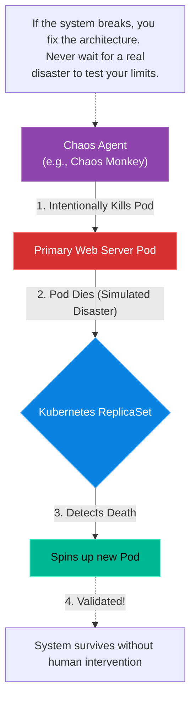

# Chapter 20 — Disaster Recovery & Chaos Engineering

## Learning Objectives

The only way to prove a system is resilient is to break it on purpose. In this chapter, we introduce Chaos Engineering, injecting controlled failures to uncover weaknesses before a real outage does.

By the end of this chapter, you will be able to:
* Define RTO (Recovery Time Objective) and RPO (Recovery Point Objective).
* Explain the principles of Chaos Engineering.
* Understand the concept of "Game Days" in an enterprise environment.
* Explain why disaster recovery plans are useless if they are not continuously tested.

## Visual Architecture: Embracing Failure

Everything fails. Hard drives fail. Fiber optic cables get cut by backhoes. AWS regions go offline. 
Junior engineers build architectures and pray they never fail. Senior engineers build architectures assuming they will fail every single day.
But how do you *prove* your architecture is resilient? If your failover mechanism is only tested when a real disaster strikes at 3:00 AM on a Sunday, it will probably fail. **Chaos Engineering** solves this by intentionally breaking your production systems during the middle of the work day.

## Theory & Concepts

### 1. RTO and RPO
When designing a Disaster Recovery (DR) strategy, the business must define two critical metrics:
* **RTO (Recovery Time Objective):** How long can the business afford to be offline? If RTO is 1 hour, you must be able to completely rebuild the infrastructure and restore the database in under 60 minutes.
* **RPO (Recovery Point Objective):** How much data can the business afford to lose? If you run database backups every 24 hours, your RPO is 24 hours. If a disaster strikes at hour 23, you lose a full day of customer data. If the business demands an RPO of 5 minutes, you must use continuous asynchronous database replication.

### 2. Chaos Engineering
Popularized by Netflix's "Chaos Monkey," Chaos Engineering is the discipline of experimenting on a system in order to build confidence in its capability to withstand turbulent conditions. Instead of waiting for a random failure, a Chaos Agent randomly terminates Virtual Machines, kills Kubernetes Pods, or injects 500ms of network latency into random microservices to ensure the system gracefully degrades or automatically recovers.

### 3. The Game Day
You do not unleash Chaos Monkey on day one. You schedule a "Game Day." All the senior engineers gather in a room on a Tuesday afternoon. Everyone knows a disaster is about to occur. A specific component (e.g., the primary Redis cache) is manually terminated. The engineers watch the monitoring dashboards to verify that the automated failover works as designed. 

## Scenario-Based Troubleshooting

### Scenario A: The Black Hole Game Day

> [!IMPORTANT]  
> **Incident Report: The Black Hole Game Day**  
> **Reporter:** SRE Team (Controlled Experiment)  
> **SOP execution:**
>
>
> 1. **14:00 PM — Incident Receipt:** The CTO demands proof that the new global AWS architecture can survive a region failure. A "Game Day" is scheduled to simulate the complete destruction of the `us-east-1` datacenter.
>
> 2. **14:02 PM — Triage & Containment:** The Lead Engineer executes a Chaos script that deletes all Network ACLs in the `us-east-1` VPC, creating a network "Black Hole."
>
> 3. **14:05 PM — Investigation:** Within 30 seconds, Route53 Health Checks fail. Global traffic redirects to `eu-west-1`. However, Datadog alerts that users cannot log in!
>
> 4. **14:08 PM — Root Cause:** The authentication microservice in Europe was hardcoded to query the master database in `us-east-1` (which is now offline). The team failed to set up an active-active global database.
>
> 5. **14:10 PM — Resolution:** The engineers abort the experiment and execute the automated rollback script, restoring the Network ACLs in `us-east-1`.
>
> 6. **14:15 PM — Verification:** The authentication service reconnects to the master database. Logins succeed. Downtime: 13 minutes (controlled).
>
> 7. **Post-Mortem:** A Blameless Post-Mortem is held. The architecture team realizes their cross-region database replication strategy was fundamentally flawed.
>
> 8. **Documentation:** Update the architecture to use Aurora Global Databases and schedule a follow-up Game Day to verify the fix.

## Common Mistakes & Pro-Tips

> [!WARNING] Common Mistake
> Running Chaos Experiments in Production without a "Big Red Button." If you simulate a database failure and it accidentally cascades and brings down the entire company billing system, you *must* have an automated, instantaneous rollback mechanism ready to abort the experiment immediately. Never inject chaos if you don't know exactly how to stop it.

> [!TIP] Pro-Tip
> You don't have to start Chaos Engineering in Production! Start by injecting chaos into your staging or testing environments during the CI/CD pipeline. Build confidence in your automated recovery scripts before you ever touch a live customer server.

## Hands-on Lab

> [!TIP]
> **Practice Assignment Available**
> Proceed to the [Chapter 20 Practice Guide](../practice-files/V4-C20-practice.md) to calculate RTO and RPO metrics for a theoretical business!

## Interview Questions

### Question 1: Define RTO and RPO in the context of Disaster Recovery.
* **Target Answer**: "RTO (Recovery Time Objective) defines the maximum acceptable downtime for the business before severe financial impact occurs. It dictates how fast the infrastructure must be restored. RPO (Recovery Point Objective) defines the maximum acceptable amount of data loss, measured in time. It dictates the frequency of your backups or the necessity of real-time database replication."

### Question 2: What is the core philosophy of Chaos Engineering?
* **Target Answer**: "The core philosophy is that failures in distributed systems are inevitable. Instead of hoping a disaster never happens, Chaos Engineering intentionally injects controlled failures (like terminating instances, dropping network packets, or consuming 100% CPU) into a production or staging environment. This proactive testing proves that the automated failover and self-healing mechanisms actually work as designed before a real, uncontrolled disaster strikes."

### Question 3: Why is a 'Blameless Post-Mortem' critical to the long-term stability of an engineering organization?
* **Target Answer**: "If an organization punishes or fires engineers for causing an outage, it creates a culture of fear. Engineers will hide their mistakes, avoid making necessary changes, and cover up near-misses. A Blameless Post-Mortem assumes the engineer acted with good intentions based on the information they had. It focuses entirely on fixing the *systemic* failures (e.g., lack of guardrails, poor testing, missing alerts) that allowed the human error to bring down the system."

## Common Mistakes & Pro-Tips

> [!WARNING] Common Mistake
> Running Chaos Experiments in Production without a "Big Red Button." If you simulate a database failure and it accidentally cascades and brings down the entire company billing system, you *must* have an automated, instantaneous rollback mechanism ready to abort the experiment immediately. Never inject chaos if you don't know exactly how to stop it.

> [!TIP] Pro-Tip
> You don't have to start Chaos Engineering in Production! Start by injecting chaos into your staging or testing environments during the CI/CD pipeline. Build confidence in your automated recovery scripts before you ever touch a live customer server.

## Chapter Summary

You have reached the end of Volume 4. You now understand that being a Senior Support Engineer is not about memorizing Linux commands; it is about architecture, scientific diagnostics, embracing failure, and building systems that can survive the chaos of the real world. 

## Completion Checklist

- [ ] I can calculate RTO and RPO.
- [ ] I understand the purpose of a Game Day.
- [ ] I can explain the cultural importance of a Blameless Post-Mortem.

---

## Navigation

⬅ Previous:
[Chapter 19 – Chapter Title](V4-C19-profiling-bottlenecks.md)

🏠 Volume Contents:
[Table of Contents](../TOC.md)

➡ Next:
[Conclusion & End Matter](V4-Z-end-matter.md)